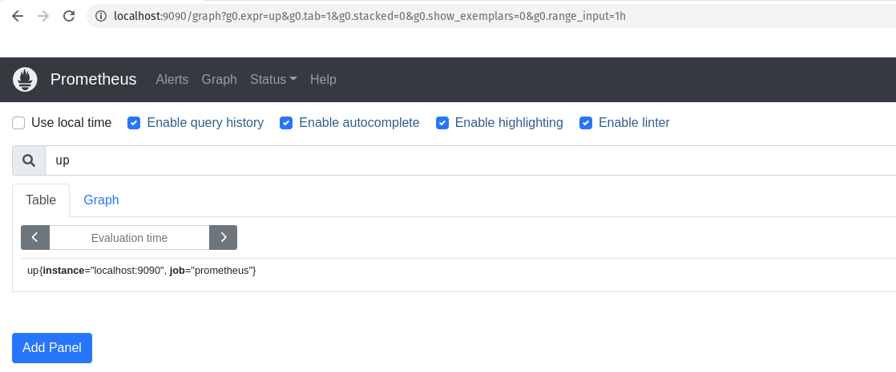
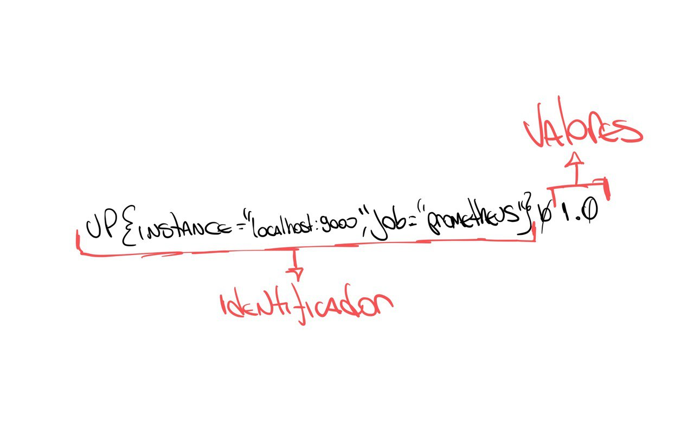
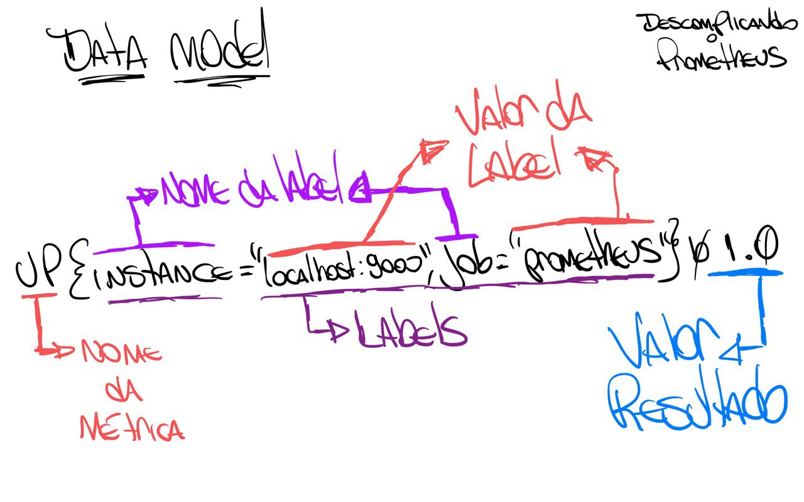
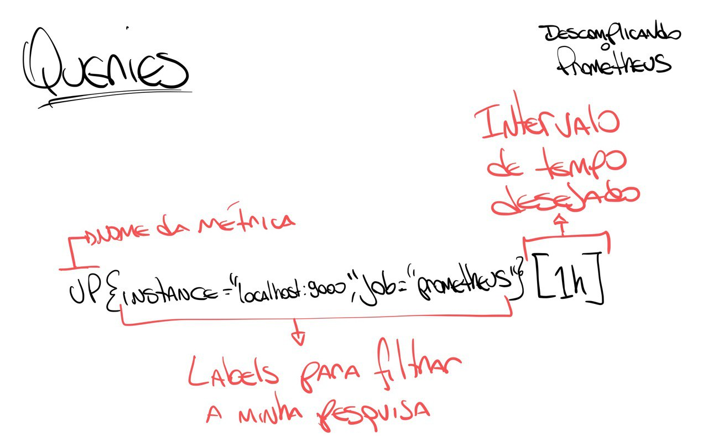
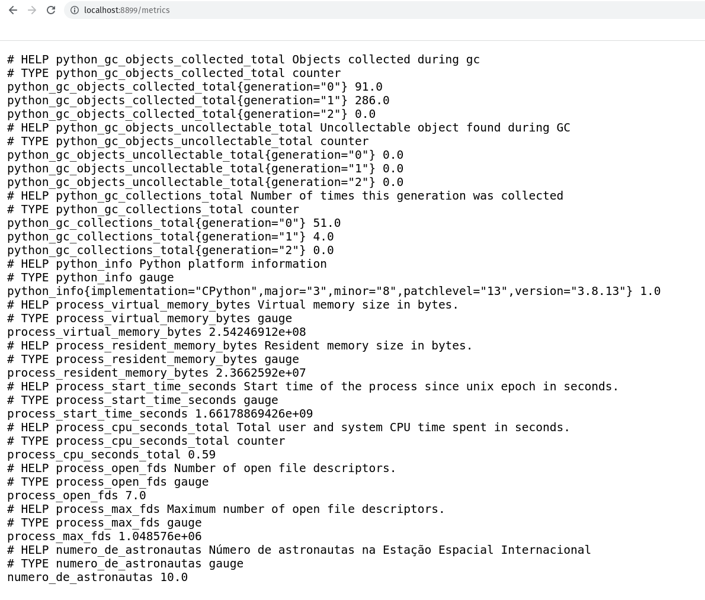
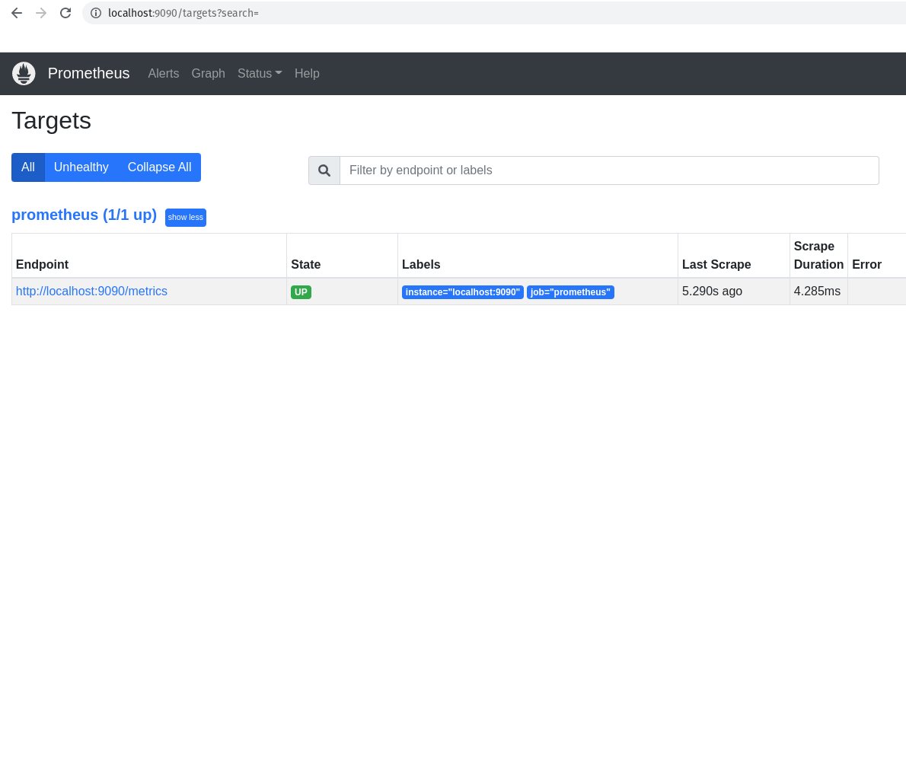
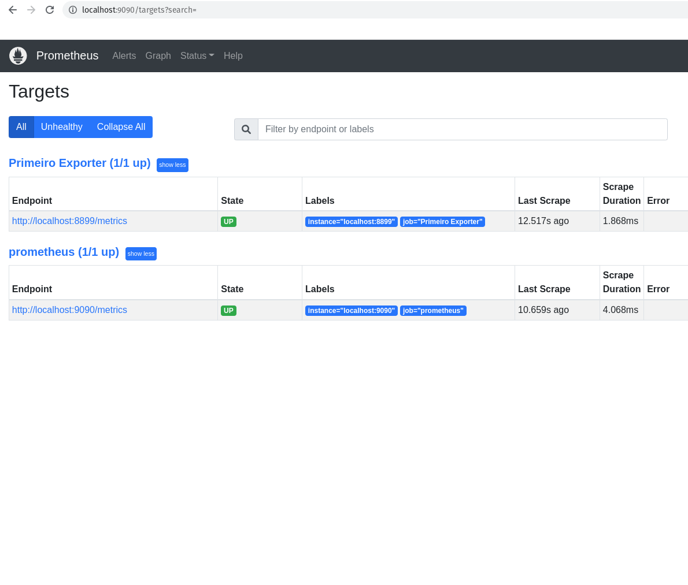
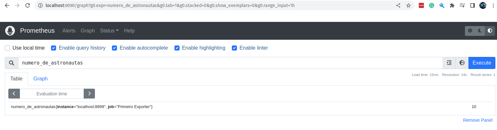
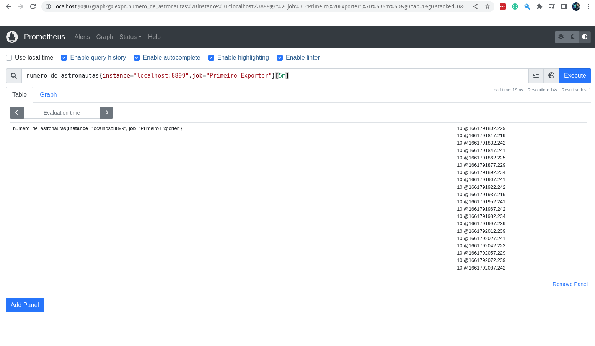

# Descomplicando o Prometheus

## DAY-2

### O que iremos ver hoje?

Seja muito bem-vinda e muito bem-vindo para o seu segundo dia de treinamento! Sim, eu considero esse livro um treinamento e não somente um guia de como obter o melhor do sensacional Prometheus!

Hoje nós vamos aprender como criar as nossa primeiras *queries* e para isso vamos precisar entender o modelo de dados que o Prometheus utiliza.

### Data Model do Prometheus

O formato de dados que o Prometheus utiliza é bastante simples, vamos pegar uma métrica e fazer uma consulta para saber o valor atual dela, assim você poderá entender melhor esse tal de *data model*.

Vamos fazer uma query para saber o valor atual da métrica `up` do servidor onde Prometheus está rodando.

```
# up
up
```

Lembrando que estamos executando a query na porta 9090, que é a porta padrão do Prometheus, lá no navegador, certo?

Somente para que você não tenha duvidas, vamos abrir o navegador e digitar:

```
http://localhost:9090/

```

Se liga no print do navegador:



Aqui o resultado dessa query é:

```
up{instance="localhost:9090",job="prometheus"} 1.0
```

Nós precisamos entender o que essa linha está dizendo, o Prometheus sempre vai seguir um padrão, e você entendendo essa padrão tudo ficará muito mais fácil.

Ahhh, caso você queira pegar o resultado da query via terminal, basta digitar:

```
curl -GET http://localhost:9090/api/v1/query --data-urlencode "query=up"
```

Somente para explicar o que a linha do curl acima faz, vamos explicar o que está acontecendo.

Vamos lá!

- O `curl` é um programa que permite fazer requisições HTTP, ou seja, você pode fazer requisições para uma URL e receber uma resposta. Nesse caso estamos pedindo para que ele faça um GET na URL `http://localhost:9090/api/v1/query` e envie uma query para o Prometheus.

- O `curl` está fazendo uma requisição para a URL `http://localhost:9090/api/v1/query`, que é a URL padrão do Prometheus.

- O `curl` está passando uma query para o Prometheus, que é a query que você estamos querendo saber o valor, ou seja, a nossa métrica `up`. *"query=up"*

- E ainda estamos passando o parâmetro `--data-urlencode` para o `curl`, que é um parâmetro que permite você fazer um  POST com dados via URL, similar ao parâmetro `--data` do `curl`.


O resultado será algo parecido com a saída abaixo:

```json
{
  "status": "success",
  "data": {
    "resultType": "vector",
    "result": [
      {
        "metric": {
            "__name__": "up",
            "instance": "localhost:9090",
            "job": "prometheus"
            },
        "value": [
            1661595487.119,
            "1"
            ]
        }
        ]
    }
}
```

Bem, o resultado da query que queriamos já está aqui, mostrei das duas formas, via interface web usando o navegador ou via terminal usando o `curl`.

Agora vamos entender o que está acontecendo.

O que o Prometheus retornou?

Vou fazer rabiscar para eu conseguir explicar melhor. :D

Primeiro vamos entender que o resultado está dividido em duas partes:

- O 'identificador' do resultado, que é o nome da métrica que você está buscando e suas labels. Ahh, as *labels* são informações que ajudam a melhorar o filtro da sua query. Por exemplo, podemos buscar a mesma métrica, mas com diferentes labels, como por exemplo, com o label `instance` como `localhost:9090`, poderíamos ter outras `instance` como `webserver-01` e `webserver-02`, por exemplo.

- O 'valor' do resultado, que é o valor atual da métrica. Essa é a segunda parte do resultado, onde você encontra o valor atual da métrica.

Se liga no desenho que eu fiz para você entender melhor, vamos lá:




Se der um zoom no desenho, vai ver que o resultado está subdivido em mais partes, afinal, além do nome da métrica, temos as labels e seus valores e finalizando com o valor atual da métrica.

Se liga nesse outro desenho:




O que sabemos então olhando o resultado dessa query é que o nosso servidor está rodando, ou seja, o Prometheus está funcionando corretamente.
Perceba que somente está o valor '1', não está falando desde quando está em execução, somente trouxe que o valor atual, o que está acontecendo agora é '1', ou seja, está rodando.

Se o valor fosse '0', significaria que o servidor não está rodando, ou seja, o Prometheus está parado.

Agora, se eu quero saber o valor da métrica `up` do servidor onde está rodando o Prometheus na última hora, teriamos que passar esse desejo para a nossa query, que fica assim:

```
up{instance="localhost:9090",job="prometheus"}[1h]
```

Nesse caso estamos especificando que queremos os valores da métrica `up` do servidor `localhost:9090` do job `prometheus` da última hora, estamos sendo bem específicos. :)

Para pedir as métricas da última hora, vamos usar o parâmetro `[1h]` no final da query.
Você usar `h` para hora, `d` para dia, `w` para semana, `m` para mês, `y` para ano.




O resultado foi enorme, certo?
E você não sabe o porquê?

Lembra que nós configuramos o Prometheus para ele fazer o *scrape* das métricas que queremos a cada 15 segundos? Então, o resultado vai ser bem grande.

Vou copiar aqui somente o primeiro resultado para você entender melhor:

```
up{instance="localhost:9090", job="prometheus"} 1 @1661595094.114
```

Perceba que agora ele trouxe o @1661595094.114, que é o timestamp da execução do scrape, ou seja, a hora em que o scrape foi capturado.


Acho que já entendemos o modelo de dados que o Prometheus retorna, então já podemos ir um pouco mais além, bora entender e descomplicar as queries utilizando a poderossa linguagem de query do Prometheus, a PromQL!


### As queries do Prometheus e o PromQL

Como mencionado ainda no Day-1, o *PromQL* é uma linguagem de query do Prometheus que permite fazer queries completas e super eficientes, e hoje vamos descomplica-la.

Eu sei que não é nenhuma novidade para você, pois nós já brincamos um pouco durante os exemplos anteriores, mas agora vamos gastar mais energia para que tudo seja mais claro e que possamos ter uma melhor compreensão do PromQL.

Antes de qualquer coisa, vamos colocar mais algumas métricas em nosso servidor, para podermos se divertir um pouco mais.

Vamos antes fazer um novo *exporter* para o Prometheus, o *exporter* do Prometheus é um programa que é executado no host alvo e o responsável por exportar as métricas para o Prometheus capturar.

Vamos entender isso melhor.

### O nosso primeiro exporter

Para o nosso exemplo, vamos criar uma aplicação bem simples feita em Python irá exportar as métricas que queremos.

A métrica que queremos é a quantidade de pessoas que estão na Estação Espacial Internacional nesse momento.
Então a métrica que queremos é simples, pelo menos por agora:

- Número de astronautas que estão no espaço


Para saber a quantidade de pessoas que estão no espaço, vamos utilizar a API Rest do [OpenNotify](http://open-notify.org/Open-Notify-API/People-In-Space/).

Vamos criar um arquivo chamado `exporter.py` no diretório `exporter`.

```python
import requests
import json
import time
from prometheus_client import start_http_server, Gauge

# URL para pegar o número de astronautas
url = 'http://api.open-notify.org/astros.json'


def pega_numero_astronautas():
    try:
        """
        Pegar o número de astronautas na estação espacial internacional
        """
        response = requests.get(url)
        data = response.json()
        return data['number']
    except Exception as e:
        print("Não foi possível acessar a url!")
        raise e

def atualiza_metricas():
    try:
        """
        Atualiza as métricas com o número de astronautas e local da estação espacial internacional
        """
        numero_pessoas = Gauge('numero_de_astronautas', 'Número de astronautas na Estação Espacial Internacional')
        
        while True:
            numero_pessoas.set(pega_numero_astronautas())
            time.sleep(10)
            print("O número atual de astronautas na Estação Espacial é: %s" % pega_numero_astronautas())
    except Exception as e:
        print("A quantidade de astronautas não pode ser atualizada!")
        raise e
        
def inicia_exporter():
    try:
        """
        Iniciar o exporter
        """
        start_http_server(8899)
        return True
    except Exception as e:
        print("O Servidor não pode ser iniciado!")
        raise e

def main():
    try:
        inicia_exporter()
        print('Exporter Iniciado')
        atualiza_metricas()
    except Exception as e:
        print('\nExporter Falhou e Foi Finalizado! \n\n======> %s\n' % e)
        exit(1)


if __name__ == '__main__':
    main()
    exit(0)

```

Agora vamos executar o nosso script para ver se está tudo certo.

```bash
chmod +x exporter.py
python exporter.py
```

Abra um outro terminal e execute o comando `curl http://localhost:8899/metrics/` para ver se está tudo certo.

```bash
curl http://localhost:8899/metrics/
```

A saída será:

```bash
curl http://localhost:8899/metrics/


# HELP python_gc_objects_collected_total Objects collected during gc
# TYPE python_gc_objects_collected_total counter
python_gc_objects_collected_total{generation="0"} 208.0
python_gc_objects_collected_total{generation="1"} 33.0
python_gc_objects_collected_total{generation="2"} 0.0
# HELP python_gc_objects_uncollectable_total Uncollectable object found during GC
# TYPE python_gc_objects_uncollectable_total counter
python_gc_objects_uncollectable_total{generation="0"} 0.0
python_gc_objects_uncollectable_total{generation="1"} 0.0
python_gc_objects_uncollectable_total{generation="2"} 0.0
# HELP python_gc_collections_total Number of times this generation was collected
# TYPE python_gc_collections_total counter
python_gc_collections_total{generation="0"} 55.0
python_gc_collections_total{generation="1"} 4.0
python_gc_collections_total{generation="2"} 0.0
# HELP python_info Python platform information
# TYPE python_info gauge
python_info{implementation="CPython",major="3",minor="10",patchlevel="4",version="3.10.4"} 1.0
# HELP process_virtual_memory_bytes Virtual memory size in bytes.
# TYPE process_virtual_memory_bytes gauge
process_virtual_memory_bytes 1.99507968e+08
# HELP process_resident_memory_bytes Resident memory size in bytes.
# TYPE process_resident_memory_bytes gauge
process_resident_memory_bytes 2.7099136e+07
# HELP process_start_time_seconds Start time of the process since unix epoch in seconds.
# TYPE process_start_time_seconds gauge
process_start_time_seconds 1.66178245236e+09
# HELP process_cpu_seconds_total Total user and system CPU time spent in seconds.
# TYPE process_cpu_seconds_total counter
process_cpu_seconds_total 0.060000000000000005
# HELP process_open_fds Number of open file descriptors.
# TYPE process_open_fds gauge
process_open_fds 6.0
# HELP process_max_fds Maximum number of open file descriptors.
# TYPE process_max_fds gauge
process_max_fds 1024.0
# HELP number_of_astronauts Number of astronauts in space
# TYPE number_of_astronauts gauge
number_of_astronauts 10.0
```

Lembrando que você pode acessar via navegador acessando http://localhost:8899/metrics/.



Perceba que estamos passando o path `/metrics`, mas qualquer path que você passar port agora, o `start_http_serve` irá responder. Por enquanto vamos deixar dessa forma, mas em breve vamos melhorar isso, mas por agora e para fins didáticos, vamos deixar assim.


Vamos colocar esse nosso primeiro exporter para rodar em um container Docker.
Antes de mais nada, faça a instalação do Docker na maioria das distribuições Linux, execute o famoso `curl`!

```bash
curl -fsSL https://get.docker.com | bash
```

Caso queira saber mais detalhes de como instalar o Docker em outros sistemas operacionais, clique [aqui](https://docs.docker.com/install/).


Vamos ter certeza de que o Docker está instalado, execute o comando `docker --version` para verificar se está funcionando.

```bash
docker --version
```

Boa! Agora já podemos criar o nosso Dockerfile para criar a nossa imagem Docker do exporter.

```dockerfile
# Vamos utilizar a imagem slim do Python
FROM python:3.8-slim

# Adicionando algumas labels para identificar a imagem
LABEL maintainer Jeferson Fernando <jeferson@linuxtips.com.br>
LABEL description "Dockerfile para criar o nosso primeiro exporter para o Prometheus"

# Adicionando o exporter.py para a nossa imagem
COPY . .

# Instalando as bibliotecas necessárias para o exporter
# através do `requirements.txt`.
RUN pip3 install -r requirements.txt

# Executando o exporter
CMD python3 exporter.py
```

Muito bom!
Já temos o nosso `Dockerfile` criado, vamos criar a nossa imagem Docker.

```bash
docker build -t primeiro-exporter:0.1 .

Sending build context to Docker daemon  5.632kB
Step 1/7 : FROM python:3.8-slim
 ---> bdd3315885d4
Step 2/7 : LABEL maintainer Jeferson Fernando <jeferson@linuxtips.com.br>
 ---> Using cache
 ---> 3d1bad97c1cb
Step 3/7 : LABEL description "Dockerfile para criar o nosso primeiro exporter para o Prometheus"
 ---> Using cache
 ---> 9f41ad63e03a
Step 4/7 : COPY . /app
 ---> Using cache
 ---> 5d9cdbc9dd36
Step 5/7 : WORKDIR /app
 ---> Using cache
 ---> 4164e416a25e
Step 6/7 : RUN pip3 install -r requirements.txt
 ---> Using cache
 ---> 9d4517e8a5c4
Step 7/7 : CMD python3 exporter.py
 ---> Using cache
 ---> 7f971cbc97ce
Successfully built 7f971cbc97ce
Successfully tagged primeiro-exporter:0.1
```

Se você quiser ver a imagem criada, execute o comando `docker images` para verificar.

```bash
docker images | grep primeiro-exporter

primeiro-exporter   0.1   7f971cbc97ce   4 minutes ago   134MB
```

Ótimo! Agora vamos rodar o nosso primeiro exporter.

```bash
docker run -p 8899:8899 --name primeiro-exporter -d primeiro-exporter:0.1
```

Bora verificar se o nosso primeiro exporter está rodando.

```bash
curl -s http://localhost:8899/metrics
```

Está rodando maravilhosamente bem!


#### Targets para o Prometheus

Agora que já temos o nosso exporter rodando maravilhosamente em nosso container Docker, vamos adicionar um novo host alvo para o Prometheus, ou seja, vamos adicionar o nosso primeiro exporter para o Prometheus.

Caso você queira executar o nosso primeiro exporter em outro computador ou vm, lembre-se de passar corretamento o endereço no momento em que adicionarmos o host alvo lá nas configurações do Prometheus.

Antes de mais nada, vamos conhecer os hosts alvos que já estão configurados no Prometheus.
Sempre que falar sobre esses hosts alvos, vamos falar em `targets`, pois um host alvo é um servidor/serviço que o Prometheus monitora, e ele chama esses hosts alvos de `targets`.


Vamos ver os hosts alvos, ou `targets`, que estão configurados no Prometheus.

```bash
curl -s http://localhost:9090/api/v1/targets
```

Para ficar mais bonita essa saída, vamos converter para JSON e para isso vamos utilizar o comando `jq`.

O comando `jq` é um comando lindo demais do [JSON](https://stedolan.github.io/jq/) que permite fazer o parse de um arquivo JSON.


Se você ainda não tem o `jq` instalado, execute o comando `sudo apt install jq` para instalar.

```bash
curl -s http://localhost:9090/api/v1/targets | jq .
```
A saída deve ter ficado bem mais bonita.

```json
{
  "status": "success",
  "data": {
    "activeTargets": [
      {
        "discoveredLabels": {
          "__address__": "localhost:9090",
          "__metrics_path__": "/metrics",
          "__scheme__": "http",
          "__scrape_interval__": "15s",
          "__scrape_timeout__": "10s",
          "job": "prometheus"
        },
        "labels": {
          "instance": "localhost:9090",
          "job": "prometheus"
        },
        "scrapePool": "prometheus",
        "scrapeUrl": "http://localhost:9090/metrics",
        "globalUrl": "http://nu-derval:9090/metrics",
        "lastError": "",
        "lastScrape": "2022-08-29T18:18:19.080077725+02:00",
        "lastScrapeDuration": 0.004360807,
        "health": "up",
        "scrapeInterval": "15s",
        "scrapeTimeout": "10s"
      }
    ],
    "droppedTargets": []
  }
}

```

Perceba que somente temos um host alvo configurado no Prometheus, que é o próprio Prometheus. Perceba que ele está configurado para buscar as métricas na porta 9090, e ele está configurado para buscar as métricas em um intervalo de 15 segundos. A porta 9090 é a porta padrão do Prometheus, a diferença é o path que ele está buscando, que é `/metrics`.

Testa a saída do comando `curl -s http://localhost:9090/metrics` e você verá as métricas do Prometheus.
IMPORTANTE: Métricas do Prometheus e não do nosso primeiro exporter.


Voltando a falar dos nossos targets, caso você não goste dessa saída via linha de comando, você pode verificar a saída via browser, claro!


```bash
http://localhost:9090/targets
```

No nosso caso, como já sabemos, somente temos um host alvo configurado no Prometheus, que é o próprio Prometheus.



O que temos que fazer agora é adicionar o nosso novo target, ou host alvo, ou chame lá como você quiser. hahaha.


##### Adicionando o nosso primeiro exporter para o Prometheus

Primeira coisa que precisamos fazer é editar o arquivo `prometheus.yml` para adicionar o nosso primeiro exporter.
Como sabemos, o nosso arquivo `prometheus.yml` está no diretório `/etc/prometheus/`.

Edite o arquivo `prometheus.yml` para adicionar o seguinte:

```yaml
global: # Configurações globais do Prometheus, ou seja, configurações que serão utilizadas em todos os jobs caso não sejam configuradas separadamente dentro de cada job.
  
  scrape_interval: 15s # Intervalo de coleta dos dados, ou seja, a cada 15 segundos o Prometheus vai até o alvo monitorado coletar as métricas, o padrão é 1 minuto.
  
  evaluation_interval: 15s # Intervalo para o Prometheus avaliar as regras de alerta, o padrão é 1 minuto. Não estamos utilizando regras para os alertas, vamos manter aqui somente para referência.

  scrape_timeout: 10s # Intervalos para o Prometheus aguardar o alvo monitorado responder antes de considerar que o alvo está indisponível, o padrão é 10 segundos.

rule_files: # Inicio da definição das regras de alerta, nesse primeiro exemplo vamos deixar sem regras, pois não iremos utilizar alertas por agora.

scrape_configs: # Inicio da definição das configurações de coleta, ou seja, como o Prometheus vai coletar as métricas e onde ele vai encontrar essas métricas.

  - job_name: "prometheus" # Nome do job, ou seja, o nome do serviço que o Prometheus vai monitorar.

    static_configs: # Inicio da definição das configurações estáticas, ou seja, configurações que não serão alteradas durante o processo de coleta.

      - targets: ["localhost:9090"] # Endereço do alvo monitorado, ou seja, o endereço do serviço que o Prometheus vai monitorar. Nesse caso é o próprio Prometheus.
  
  - job_name: "Primeiro Exporter" # Nome do job que vai coletar as métricas do primeiro exporter.
    static_configs:
      - targets: ["localhost:8899"] # Endereço do alvo monitorado, ou seja, o nosso primeiro exporter.
```

Agora que já editamos o arquivo e adicionamos um novo job, precisamos atualizar o Prometheus.

```bash
sudo systemctl restart prometheus
```

Bora conferir se o nosso primeiro exporter já está configurado como target no Prometheus.

```bash
curl -s http://localhost:9090/api/v1/targets | jq . 
```

A saída mudou, não?!?

```json
{
  "status": "success",
  "data": {
    "activeTargets": [
      {
        "discoveredLabels": {
          "__address__": "localhost:8899",
          "__metrics_path__": "/metrics",
          "__scheme__": "http",
          "__scrape_interval__": "15s",
          "__scrape_timeout__": "10s",
          "job": "Primeiro Exporter"
        },
        "labels": {
          "instance": "localhost:8899",
          "job": "Primeiro Exporter"
        },
        "scrapePool": "Primeiro Exporter",
        "scrapeUrl": "http://localhost:8899/metrics",
        "globalUrl": "http://nu-derval:8899/metrics",
        "lastError": "",
        "lastScrape": "2022-08-29T18:37:17.239059844+02:00",
        "lastScrapeDuration": 0.002143502,
        "health": "up",
        "scrapeInterval": "15s",
        "scrapeTimeout": "10s"
      },
      {
        "discoveredLabels": {
          "__address__": "localhost:9090",
          "__metrics_path__": "/metrics",
          "__scheme__": "http",
          "__scrape_interval__": "15s",
          "__scrape_timeout__": "10s",
          "job": "prometheus"
        },
        "labels": {
          "instance": "localhost:9090",
          "job": "prometheus"
        },
        "scrapePool": "prometheus",
        "scrapeUrl": "http://localhost:9090/metrics",
        "globalUrl": "http://nu-derval:9090/metrics",
        "lastError": "",
        "lastScrape": "2022-08-29T18:37:19.08239274+02:00",
        "lastScrapeDuration": 0.004655397,
        "health": "up",
        "scrapeInterval": "15s",
        "scrapeTimeout": "10s"
      }
    ],
    "droppedTargets": []
  }
}
```

Essa é a saída que é importante para nos sabermos se o nosso primeiro exporter está configurado como target no Prometheus.

```json
"activeTargets": [
      {
        "discoveredLabels": {
          "__address__": "localhost:8899",
          "__metrics_path__": "/metrics",
          "__scheme__": "http",
          "__scrape_interval__": "15s",
          "__scrape_timeout__": "10s",
          "job": "Primeiro Exporter"
        },
        "labels": {
          "instance": "localhost:8899",
          "job": "Primeiro Exporter"
        },
        "scrapePool": "Primeiro Exporter",
        "scrapeUrl": "http://localhost:8899/metrics",
        "globalUrl": "http://nu-derval:8899/metrics",
        "lastError": "",
        "lastScrape": "2022-08-29T18:37:17.239059844+02:00",
        "lastScrapeDuration": 0.002143502,
        "health": "up",
        "scrapeInterval": "15s",
        "scrapeTimeout": "10s"
      },
```

Caso queira fazer um `grep` na saída para ver se o nosso primeiro exporter está na lista de targets, vamos fazer isso:

```bash
curl -s http://localhost:9090/api/v1/targets | jq . | grep -i "localhost:8899"
```

E ainda podemos ver via navegador, conforme abaixo:




### Visualizando as métricas do nosso primeiro exporter

Muito bem, fizemos tudo isso somente para mostrar uma nova métrica aparecendo no Prometheus, além da métrica que já vem por padrão.

A métrica que criamos é totalmente customizada e nem tem muita utilidade, mas é importante para sabermos todos os detalhes da construção de uma métrica, e como o Prometheus lida com ela, desde o primeiro passo até o último.

Noiz já entendemos como construir uma métrica do zero, aprendemos como o Prometheus lida e armazena ela, agora vamos ver o que precisamos, nesse primeiro momento, para busca-la utilizando as queries no Prometheus.

Vamos acessar a interface web do Prometheus e digite a seguinte query na barra de pesquisa:

```PROMQL
numero_de_astronautas
```

Com isso você já receberá o valor da métrica, ou melhor, o último valor que foi armazenado no Prometheus.



Via linha de comando você já sabe como fazer, certo?

```bash
curl -s http://localhost:9090/api/v1/query?query=numero_de_astronautas | jq .
```

Você vai receber a seguinte saída:

```json
{
  "status": "success",
  "data": {
    "resultType": "vector",
    "result": [
      {
        "metric": {
          "__name__": "numero_de_astronautas",
          "instance": "localhost:8899",
          "job": "Primeiro Exporter"
        },
        "value": [
          1661792007.877,
          "10"
        ]
      }
    ]
  }
}
```

Muito bom! A nossa métrica está por lá!
Uma coisa que podemos fazer é começar a ser mais cirúrgicos, e fazer as queries utilizando o máximo de parâmetros possíveis.

Por exemplo, podemos passar alguns labels para a query, como o nome do job e o nome do instance.


```PROMQL
numero_de_astronautas{instance="localhost:8899",job="Primeiro Exporter"}
```

O resultado será o mesmo que o anterior, porém agora com os labels passados. :D


Agora, eu consigo ver o valor dessa métrica nos últimos 5 minutos?

Claro!

```PROMQL
numero_de_astronautas{instance="localhost:8899",job="Primeiro Exporter"}[5m]
```




O valor não muda, afinal não é tão fácil assim mudar os astronautas que estão na Estação Espacial. hahaha


E se adicionarmos mais uma métrica?
Vamos imaginar que é importante saber onde está a Estação Espacial nesse momento! Eu sei que ela está no espaço, engraçadão!

O que eu quero saber é em qual parte do planeta Terra (que é redondo) ela está passando por cima? 
Eu sei que o open-notify tem uma API para isso, vamos adicionar essa nova métrica para o nosso primeiro exporter.


Vamos editar e adicionar essa nova configuração em nosso script Python, o arquivo `exporter.py`:

```python
import requests
import json
import time
from prometheus_client import start_http_server, Gauge

# URL para pegar o número de astronautas
url_numero_pessoas = 'http://api.open-notify.org/astros.json'
url_local_ISS = 'http://api.open-notify.org/iss-now.json'


def pega_local_ISS():
    try:
        """
        Pegar o local da estação espacial internacional
        """
        response = requests.get(url_local_ISS)
        data = response.json()
        return data['iss_position']
    except Exception as e:
        print("Não foi possível acessar a url!")
        raise e

def pega_numero_astronautas():
    try:
        """
        Pegar o número de astronautas na estação espacial internacional
        """
        response = requests.get(url_numero_pessoas)
        data = response.json()
        return data['number']
    except Exception as e:
        print("Não foi possível acessar a url!")
        raise e

def atualiza_metricas():
    try:
        """
        Atualiza as métricas com o número de astronautas e local da estação espacial internacional
        """
        numero_pessoas = Gauge('numero_de_astronautas', 'Número de astronautas na Estação Espacial Internacional')
        longitude = Gauge('longitude_ISS', 'Longitude da Estação Espacial Internacional')
        latitude = Gauge('latitude_ISS', 'Latitude da Estação Espacial Internacional')

        while True:
            numero_pessoas.set(pega_numero_astronautas())
            longitude.set(pega_local_ISS()['longitude'])
            latitude.set(pega_local_ISS()['latitude'])
            time.sleep(10)
            print("O número atual de astronautas na Estação Espacial é: %s" % pega_numero_astronautas())
            print("A longitude atual da Estação Espacial Internacional é: %s" % pega_local_ISS()['longitude'])
            print("A latitude atual da Estação Espacial Internacional é: %s" % pega_local_ISS()['latitude'])
    except Exception as e:
        print("Problemas para atualizar as métricas! \n\n====> %s \n" % e)
        raise e
        
def inicia_exporter():
    try:
        """
        Iniciar o exporter
        """
        start_http_server(8899)
        return True
    except Exception as e:
        print("O Servidor não pode ser iniciado!")
        raise e


def main():
    try:
        inicia_exporter()
        print('Exporter Iniciado')
        atualiza_metricas()
    except Exception as e:
        print('\nExporter Falhou e Foi Finalizado! \n\n======> %s\n' % e)
        exit(1)


if __name__ == '__main__':
    main()
    exit(0)

```

Muito bem, já adicionamos as novas instruções para o nosso exporter.
Basicamente falamos para a biblioteca `prometheus_client` que temos duas novas métricas:

- longitude_ISS: Longitude da Estação Espacial Internacional
- latitude_ISS: Latitude da Estação Espacial Internacional

Vamos executar o nosso script para saber se está tudo funcionando bem:

```bash
python3 exporter.py

O número atual de astronautas na Estação Espacial é: 10
A longitude atual da Estação Espacial Internacional é: 57.7301
A latitude atual da Estação Espacial Internacional é: -32.7545
```


Muito bem, está funcionando! As duas novas métricas já estão disponível e sendo expostas. 
Agora já podemos criar uma nova imagem com a nova versão do nosso script!

```bash
docker build -t primeiro-exporter:1.0 .

Sending build context to Docker daemon  6.656kB
Step 1/7 : FROM python:3.8-slim
 ---> bdd3315885d4
Step 2/7 : LABEL maintainer Jeferson Fernando <jeferson@linuxtips.com.br>
 ---> Using cache
 ---> 3d1bad97c1cb
Step 3/7 : LABEL description "Dockerfile para criar o nosso primeiro exporter para o Prometheus"
 ---> Using cache
 ---> 9f41ad63e03a
Step 4/7 : COPY . /app
 ---> Using cache
 ---> 6bc6f9a126f4
Step 5/7 : WORKDIR /app
 ---> Using cache
 ---> 05f03d2025c2
Step 6/7 : RUN pip3 install -r requirements.txt
 ---> Using cache
 ---> 3f2ec4cdfe6a
Step 7/7 : CMD python3 exporter.py
 ---> Using cache
 ---> 6d63ade160c4
Successfully built 6d63ade160c4
Successfully tagged primeiro-exporter:1.0
```

Vamos executar e conferir o resultado!

```bash
docker run -d -p 8899:8899 primeiro-exporter:1.0
```

Vamos conferir se as nossas métricas estão chegando no Prometheus.
Vamos primeiro verificar a `longitude_ISS`:


```bash
curl -s http://localhost:9090/api/v1/query\?query\=longitude_ISS | jq .
```

Agora bora conferir a a `latitude_ISS`:

```bash
curl -s http://localhost:9090/api/v1/query\?query\=latitude_ISS | jq .
```


Evidente que podemos conferir tudo isso via interface web. 

Vamos verificar a `longitude_ISS` nos últimos 05 minutos:

```PROMQL
longitude_ISS{instance="localhost:8899",job="Primeiro Exporter"}[5m]
```


Muito bem! 

Já estamos com o nosso primeiro exporter configurado como target no Prometheus.
Durante essa parte do treinamento entendemos o que é um exporter, como ele funciona e até criamos um novo exporter para chamar de nosso.

Aprendemos como configurar o nosso primeiro exporter como um target no Prometheus, entendemos o que é um job, aprendemos a configuração básica dele e como consultar os targets do Prometheus, seja via linha de comando ou via interface web.

