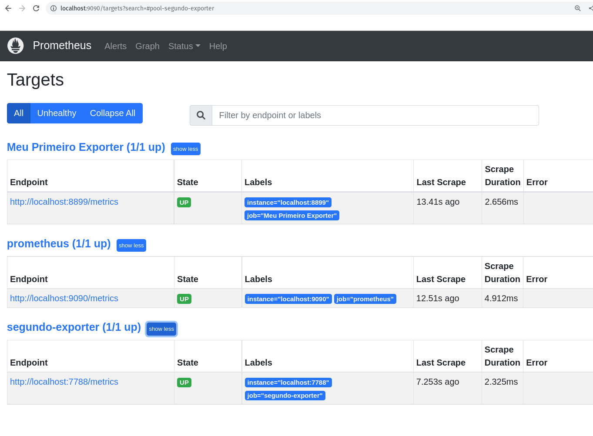
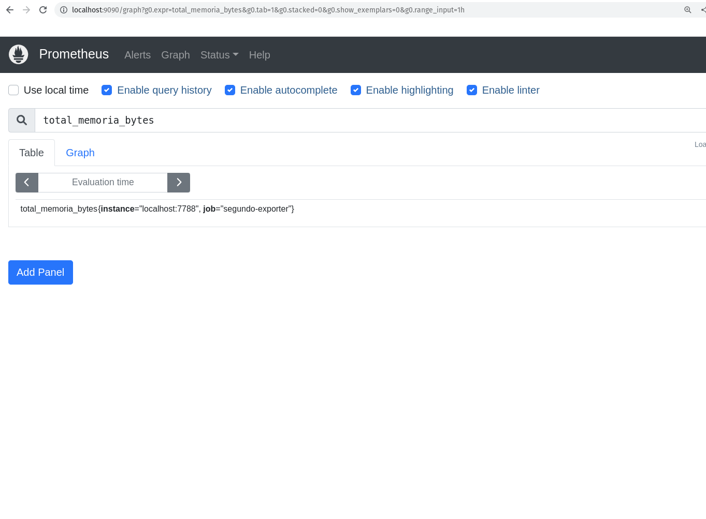

# Descomplicando o Prometheus

## DAY-3

### O que iremos ver hoje?


### Criando o nosso segundo exporter

Agora que já vimos como criar um exporter, vamos criar um segundo exporter para monitorar o consumo de memória do nosso servidor.

Hoje vamos criar um exporter em Go, então antes de mais nada temos que instalar o Go em nossa máquina.

Para instalar o Go no Ubuntu, basta executar o seguinte comando:

```bash
sudo apt install golang
```

&nbsp;


Veja no site oficial do Go como instalar em outras distribuições.


Vamos criar um arquivo chamado `segundo-exporter.go` no diretório `segundo-exporter` e vamos adicionar o seguinte código:

```GO
package main

import ( // importando as bibliotecas necessárias
	"log"      // log
	"net/http" // http

	"github.com/pbnjay/memory"                                // biblioteca para pegar informações de memória
	"github.com/prometheus/client_golang/prometheus"          // biblioteca para criar o nosso exporter
	"github.com/prometheus/client_golang/prometheus/promhttp" // biblioteca criar o servidor web
)

func memoriaLivre() float64 { // função para pegar a memória livre
	memoria_livre := memory.FreeMemory() // pegando a memória livre através da função FreeMemory() da biblioteca memory
	return float64(memoria_livre)        // retornando o valor da memória livre
}

func totalMemory() float64 { // função para pegar a memória total
	memoria_total := memory.TotalMemory() // pegando a memória total através da função TotalMemory() da biblioteca memory
	return float64(memoria_total)         // retornando o valor da memória total
}

var ( // variáveis para definir as nossas métricas do tipo Gauge
	memoriaLivreBytesGauge = prometheus.NewGauge(prometheus.GaugeOpts{ // métrica para pegar a memória livre em bytes
		Name: "memoria_livre_bytes",                  // nome da métrica
		Help: "Quantidade de memória livre em bytes", // descrição da métrica
	})

	memoriaLivreMegabytesGauge = prometheus.NewGauge(prometheus.GaugeOpts{ // métrica para pegar a memória livre em megabytes
		Name: "memoria_livre_megabytes",                  // nome da métrica
		Help: "Quantidade de memória livre em megabytes", // descrição da métrica
	})

	totalMemoryBytesGauge = prometheus.NewGauge(prometheus.GaugeOpts{ // métrica para pegar a memória total em bytes
		Name: "total_memoria_bytes",                  // nome da métrica
		Help: "Quantidade total de memória em bytes", // descrição da métrica
	})

	totalMemoryGigaBytesGauge = prometheus.NewGauge(prometheus.GaugeOpts{ // métrica para pegar a memória total em gigabytes
		Name: "total_memoria_gigabytes",                  // nome da métrica
		Help: "Quantidade total de memória em gigabytes", // descrição da métrica
	})
)

func init() { // função para registrar as métricas

	prometheus.MustRegister(memoriaLivreBytesGauge)     // registrando a métrica de memória livre em bytes
	prometheus.MustRegister(memoriaLivreMegabytesGauge) // registrando a métrica de memória livre em megabytes
	prometheus.MustRegister(totalMemoryBytesGauge)      // registrando a métrica de memória total em bytes
	prometheus.MustRegister(totalMemoryGigaBytesGauge)  // registrando a métrica de memória total em gigabytes
}

func main() { // função principal
	memoriaLivreBytesGauge.Set(memoriaLivre())                        // setando o valor da métrica de memória livre em bytes
	memoriaLivreMegabytesGauge.Set(memoriaLivre() / 1024 / 1024)      // setando o valor da métrica de memória livre em megabytes
	totalMemoryBytesGauge.Set(totalMemory())                          // setando o valor da métrica de memória total em bytes
	totalMemoryGigaBytesGauge.Set(totalMemory() / 1024 / 1024 / 1024) // setando o valor da métrica de memória total em gigabytes

	http.Handle("/metrics", promhttp.Handler()) // criando o servidor web para expor as métricas

	log.Fatal(http.ListenAndServe(":7788", nil)) // iniciando o servidor web na porta 7788
}
```

&nbsp;


O código acima está todo comentado explicando o que cada linha faz, então não vou me estender muito explicando o código.

Mas básicamente estamos criando um exporter que vai expor 4 métricas:

* `memoria_livre_bytes` - métrica que vai retornar a quantidade de memória livre em bytes
* `memoria_livre_megabytes` - métrica que vai retornar a quantidade de memória livre em megabytes
* `total_memoria_bytes` - métrica que vai retornar a quantidade total de memória em bytes
* `total_memoria_gigabytes` - métrica que vai retornar a quantidade total de memória em gigabytes

&nbsp;

Lembrando que estamos utilizando os pacotes `prometheus` para criar o nosso exporter e `promhttp` para expor as métricas através de um servidor web.
Também estamos utilizando o pacote `memory` para pegar as informações de memória do nosso servidor, valeu usuário do GitHub *pbnjay* por criar essa biblioteca.

Estamos utilizando o pacote `log` para logar os erros que possam acontecer e o pacote `net/http` para criar o webserver.

&nbsp;


Agora vamos compilar o nosso código e executar o nosso exporter, mas antes precisamos instalar as bibliotecas que utilizamos no nosso código.

```BASH
go get github.com/pbnjay/memory
go get github.com/prometheus/client_golang/prometheus
go get github.com/prometheus/client_golang/prometheus/promhttp
```

Agora sim já podemos compilar o nosso código conforme o exemplo abaixo:

```BASH
go build segundo-exporter.go
```

Perceba que foi gerado um binário Go chamado `segundo-exporter`, vamos executa-lo:

```BASH
./segundo-exporter
```

&nbsp;

Nós configuramos o web server do nosso exporter para rodar na porta 7788, vamos acessar a URL `http://localhost:7788/metrics` para ver as métricas que o nosso exporter está exportando.

Você pode verificar as métricas atráves do navegador ou utilizando o comando `curl`:

```BASH
curl http://localhost:7788/metrics
```

&nbsp;

A saída deve ser algo parecido com o exemplo abaixo:

```BASH
# HELP go_gc_duration_seconds A summary of the pause duration of garbage collection cycles.
# TYPE go_gc_duration_seconds summary
go_gc_duration_seconds{quantile="0"} 4.4072e-05
go_gc_duration_seconds{quantile="0.25"} 4.4072e-05
go_gc_duration_seconds{quantile="0.5"} 8.7174e-05
go_gc_duration_seconds{quantile="0.75"} 8.7174e-05
go_gc_duration_seconds{quantile="1"} 8.7174e-05
go_gc_duration_seconds_sum 0.000131246
go_gc_duration_seconds_count 2
# HELP go_goroutines Number of goroutines that currently exist.
# TYPE go_goroutines gauge
go_goroutines 8
# HELP go_info Information about the Go environment.
# TYPE go_info gauge
go_info{version="go1.18.1"} 1
# HELP go_memstats_alloc_bytes Number of bytes allocated and still in use.
# TYPE go_memstats_alloc_bytes gauge
go_memstats_alloc_bytes 4.69292e+06
# HELP go_memstats_alloc_bytes_total Total number of bytes allocated, even if freed.
# TYPE go_memstats_alloc_bytes_total counter
go_memstats_alloc_bytes_total 6.622168e+06
# HELP go_memstats_buck_hash_sys_bytes Number of bytes used by the profiling bucket hash table.
# TYPE go_memstats_buck_hash_sys_bytes gauge
go_memstats_buck_hash_sys_bytes 4248
# HELP go_memstats_frees_total Total number of frees.
# TYPE go_memstats_frees_total counter
go_memstats_frees_total 6221
# HELP go_memstats_gc_sys_bytes Number of bytes used for garbage collection system metadata.
# TYPE go_memstats_gc_sys_bytes gauge
go_memstats_gc_sys_bytes 4.709704e+06
# HELP go_memstats_heap_alloc_bytes Number of heap bytes allocated and still in use.
# TYPE go_memstats_heap_alloc_bytes gauge
go_memstats_heap_alloc_bytes 4.69292e+06
# HELP go_memstats_heap_idle_bytes Number of heap bytes waiting to be used.
# TYPE go_memstats_heap_idle_bytes gauge
go_memstats_heap_idle_bytes 2.392064e+06
# HELP go_memstats_heap_inuse_bytes Number of heap bytes that are in use.
# TYPE go_memstats_heap_inuse_bytes gauge
go_memstats_heap_inuse_bytes 5.24288e+06
# HELP go_memstats_heap_objects Number of allocated objects.
# TYPE go_memstats_heap_objects gauge
go_memstats_heap_objects 22935
# HELP go_memstats_heap_released_bytes Number of heap bytes released to OS.
# TYPE go_memstats_heap_released_bytes gauge
go_memstats_heap_released_bytes 1.662976e+06
# HELP go_memstats_heap_sys_bytes Number of heap bytes obtained from system.
# TYPE go_memstats_heap_sys_bytes gauge
go_memstats_heap_sys_bytes 7.634944e+06
# HELP go_memstats_last_gc_time_seconds Number of seconds since 1970 of last garbage collection.
# TYPE go_memstats_last_gc_time_seconds gauge
go_memstats_last_gc_time_seconds 1.6623888726616032e+09
# HELP go_memstats_lookups_total Total number of pointer lookups.
# TYPE go_memstats_lookups_total counter
go_memstats_lookups_total 0
# HELP go_memstats_mallocs_total Total number of mallocs.
# TYPE go_memstats_mallocs_total counter
go_memstats_mallocs_total 29156
# HELP go_memstats_mcache_inuse_bytes Number of bytes in use by mcache structures.
# TYPE go_memstats_mcache_inuse_bytes gauge
go_memstats_mcache_inuse_bytes 38400
# HELP go_memstats_mcache_sys_bytes Number of bytes used for mcache structures obtained from system.
# TYPE go_memstats_mcache_sys_bytes gauge
go_memstats_mcache_sys_bytes 46800
# HELP go_memstats_mspan_inuse_bytes Number of bytes in use by mspan structures.
# TYPE go_memstats_mspan_inuse_bytes gauge
go_memstats_mspan_inuse_bytes 107712
# HELP go_memstats_mspan_sys_bytes Number of bytes used for mspan structures obtained from system.
# TYPE go_memstats_mspan_sys_bytes gauge
go_memstats_mspan_sys_bytes 114240
# HELP go_memstats_next_gc_bytes Number of heap bytes when next garbage collection will take place.
# TYPE go_memstats_next_gc_bytes gauge
go_memstats_next_gc_bytes 5.281792e+06
# HELP go_memstats_other_sys_bytes Number of bytes used for other system allocations.
# TYPE go_memstats_other_sys_bytes gauge
go_memstats_other_sys_bytes 1.43568e+06
# HELP go_memstats_stack_inuse_bytes Number of bytes in use by the stack allocator.
# TYPE go_memstats_stack_inuse_bytes gauge
go_memstats_stack_inuse_bytes 688128
# HELP go_memstats_stack_sys_bytes Number of bytes obtained from system for stack allocator.
# TYPE go_memstats_stack_sys_bytes gauge
go_memstats_stack_sys_bytes 688128
# HELP go_memstats_sys_bytes Number of bytes obtained from system.
# TYPE go_memstats_sys_bytes gauge
go_memstats_sys_bytes 1.4633744e+07
# HELP go_threads Number of OS threads created.
# TYPE go_threads gauge
go_threads 13
# HELP memoria_livre_bytes Quantidade de memória livre em bytes
# TYPE memoria_livre_bytes gauge
memoria_livre_bytes 5.0984931328e+10
# HELP memoria_livre_megabytes Quantidade de memória livre em megabytes
# TYPE memoria_livre_megabytes gauge
memoria_livre_megabytes 48623.01953125
# HELP process_cpu_seconds_total Total user and system CPU time spent in seconds.
# TYPE process_cpu_seconds_total counter
process_cpu_seconds_total 0.02
# HELP process_max_fds Maximum number of open file descriptors.
# TYPE process_max_fds gauge
process_max_fds 1.048576e+06
# HELP process_open_fds Number of open file descriptors.
# TYPE process_open_fds gauge
process_open_fds 35
# HELP process_resident_memory_bytes Resident memory size in bytes.
# TYPE process_resident_memory_bytes gauge
process_resident_memory_bytes 1.4884864e+07
# HELP process_start_time_seconds Start time of the process since unix epoch in seconds.
# TYPE process_start_time_seconds gauge
process_start_time_seconds 1.66238886841e+09
# HELP process_virtual_memory_bytes Virtual memory size in bytes.
# TYPE process_virtual_memory_bytes gauge
process_virtual_memory_bytes 1.494904832e+09
# HELP process_virtual_memory_max_bytes Maximum amount of virtual memory available in bytes.
# TYPE process_virtual_memory_max_bytes gauge
process_virtual_memory_max_bytes 1.8446744073709552e+19
# HELP promhttp_metric_handler_requests_in_flight Current number of scrapes being served.
# TYPE promhttp_metric_handler_requests_in_flight gauge
promhttp_metric_handler_requests_in_flight 1
# HELP promhttp_metric_handler_requests_total Total number of scrapes by HTTP status code.
# TYPE promhttp_metric_handler_requests_total counter
promhttp_metric_handler_requests_total{code="200"} 6
promhttp_metric_handler_requests_total{code="500"} 0
promhttp_metric_handler_requests_total{code="503"} 0
# HELP total_memoria_bytes Quantidade total de memória em bytes
# TYPE total_memoria_bytes gauge
total_memoria_bytes 6.7332653056e+10
# HELP total_memoria_gigabytes Quantidade total de memória em gigabytes
# TYPE total_memoria_gigabytes gauge
total_memoria_gigabytes 62.70841979980469
```

Perceba que as nossas métricas estão lá, são elas:

  * `memoria_livre_bytes`
  * `memoria_livre_megabytes`
  * `total_memoria_bytes`
  * `total_memoria_gigabytes`

Está funcionando lindamente.

Agora vamos adicionar o nosso segundo exporter em um outro container, para isso vamos criar um arquivo chamado `Dockerfile` no diretório `segundo-exporter` com o seguinte conteúdo:

```dockerfile
FROM golang:1.19.0-alpine3.16 AS buildando

WORKDIR /app
COPY . /app
CMD ["go", "build", "segundo-exporter.go"]

FROM alpine:3.16
LABEL maintainer Jeferson Fernando <jeferson@linuxtips.com.br>
LABEL description "Executando o nosso segundo exporter"
COPY --from=builder /app/segundo-exporter /app/segundo-exporter
EXPOSE 7788
WORKDIR /app
CMD ["./segundo-exporter"]
```

&nbsp;

Agora vamos buildar a imagem do nosso segundo exporter, para isso vamos executar o seguinte comando:

```bash
docker build -t segundo-exporter:1.0 .
```

&nbsp;

Vamos listar a nossa nova imagem de container com o nosso segundo exporter:

```bash
docker images | grep segundo-exporter
```

&nbsp;

Muito bom, está lá, agora vamos executar o nosso segundo exporter:

```bash
docker run -d --name segundo-exporter -p 7788:7788 segundo-exporter:1.0
```

&nbsp;

Agora vamos listar os nossos containers em execução:

```bash
docker ps
```

&nbsp;

Ele está lá:
  
  ```bash
CONTAINER ID   IMAGE                  COMMAND                CREATED         STATUS         PORTS                                       NAMES
e51e819c6069   segundo-exporter:1.0   "./segundo-exporter"   6 seconds ago   Up 5 seconds   0.0.0.0:7788->7788/tcp, :::7788->7788/tcp   segundo-exporter
```

&nbsp;

Vamos acessar as métricas do nosso segundo exporter:

```bash
curl http://localhost:7788/metrics
```

Tudo funcionando maravilhosamente bem!

Agora já podemos configurar o Prometheus para monitorar o nosso segundo exporter. Para isso temos que editar o arquivo `prometheus.yml` e adicionar o seguinte conteúdo:

```yaml
global:
  scrape_interval: 15s
  evaluation_interval: 15s

rule_files:
scrape_configs:
  - job_name: "prometheus"
    static_configs:
      - targets: ["localhost:9090"]

  - job_name: "Meu Primeiro Exporter"
    static_configs:
      - targets: ["localhost:8899"]
  
  - job_name: 'segundo-exporter'
    static_configs:
      - targets: ['localhost:7788']
```

&nbsp;

Pronto, agora vamos fazer o restart do Prometheus para que ele carregue as novas configurações:

```bash
systemctl restart prometheus
```

&nbsp;

Vocês também pode fazer isso via comando kill, mas o restart é mais gostosinho de ai meu dels.

```bash
kill -HUP $(pidof prometheus)
```

&nbsp;

Agora vamos acessar o Prometheus e verificar se o novo target e as nossas novas métricas estão por lá:

```bash
http://localhost:9090
```

O nosso novo target está lá:




&nbsp;

E as nossa novas métricas também:


&nbsp;



&nbsp;
### Operadores

Precisamos falar sobre os operadores, super importante para que possamos trazer ainda mais poder ao nosso querido PromQL e obter resultados ainda mais interessantes.

Vamos conhecer alguns! 

&nbsp;
&nbsp;

#### Operador de igualdade

O operador de igualdade é utilizado para comparar se dois valores são iguais. 

```PROMQL
metrica == 1
```

&nbsp;

Onde `metrica` é a métrica que você deseja comparar e `1` é o valor que você deseja comparar, logo se o valor da métrica for igual a 1, o resultado será verdadeiro.

&nbsp;
&nbsp;

#### Operador de diferença

O operador de diferença é utilizado para comparar se dois valores são diferentes. 

```PROMQL
metrica != 1
```

&nbsp;

Onde `metrica` é a métrica que você deseja comparar e `1` é o valor que você deseja comparar, logo se o valor da métrica for diferente de 1, o resultado será verdadeiro.


&nbsp;
&nbsp;

#### Operador de maior que

O operador de maior que é utilizado para comparar se um valor é maior que outro. 

```PROMQL
metrica > 1
```

&nbsp;

Onde `metrica` é a métrica que você deseja comparar e `1` é o valor que você deseja comparar, logo se o valor da métrica for maior que 1, o resultado será verdadeiro.

&nbsp;
&nbsp;

#### Operador de menor que

O operador de menor que é utilizado para comparar se um valor é menor que outro. 

```PROMQL
metrica < 1
```

&nbsp;

Onde `metrica` é a métrica que você deseja comparar e `1` é o valor que você deseja comparar, logo se o valor da métrica for menor que 1, o resultado será verdadeiro.

&nbsp;
&nbsp;

#### Operador de maior ou igual que

O operador de maior ou igual que é utilizado para comparar se um valor é maior ou igual que outro. 

```PROMQL
metrica >= 1
```

&nbsp;

Onde `metrica` é a métrica que você deseja comparar e `1` é o valor que você deseja comparar, logo se o valor da métrica for maior ou igual a 1, o resultado será verdadeiro.

&nbsp;
&nbsp;

#### Operador de menor ou igual que

O operador de menor ou igual que é utilizado para comparar se um valor é menor ou igual que outro. 

```PROMQL
metrica <= 1
```

&nbsp;

Onde `metrica` é a métrica que você deseja comparar e `1` é o valor que você deseja comparar, logo se o valor da métrica for menor ou igual a 1, o resultado será verdadeiro.


&nbsp;
&nbsp;

#### Operador de multiplicação

O operador de multiplicação é utilizado para multiplicar dois valores. 

```PROMQL
metrica * 1
```

&nbsp;

Onde `metrica` é a métrica que você deseja multiplicar e `1` é o valor que você deseja multiplicar, logo se o valor da métrica for multiplicado por 1, o resultado será o valor da métrica.

&nbsp;
&nbsp;

#### Operador de divisão

O operador de divisão é utilizado para dividir dois valores. 

```PROMQL
metrica / 1
```

&nbsp;

Onde `metrica` é a métrica que você deseja dividir e `1` é o valor pelo qual você deseja dividir a `metrica`. O resultado será o valor da métrica dividido pelo valor que você passou.

&nbsp;
&nbsp;

#### Operador de adição

O operador de adição é utilizado para somar dois valores. 

```PROMQL
metrica + 1
```

&nbsp;

Onde `metrica` é a métrica que você deseja somar e `1` é o valor que você deseja somar a `metrica`. O resultado será o valor da métrica somado ao valor que você passou.

&nbsp;
&nbsp;

#### Operador de subtração

O operador de subtração é utilizado para subtrair dois valores. 

```PROMQL
metrica - 1
```

&nbsp;

Onde `metrica` é a métrica que você deseja subtrair e `1` é o valor que você deseja subtrair da `metrica`. O resultado será o valor da métrica subtraído pelo valor que você passou.

&nbsp;
&nbsp;

#### Operador de modulo

O operador de modulo é utilizado para obter o resto da divisão de dois valores. 

```PROMQL
metrica % 1
```

&nbsp;

Onde `metrica` é a métrica que você deseja obter o resto da divisão e `1` é o valor pelo qual você deseja obter o resto da divisão da `metrica`. O resultado será o resto da divisão da métrica pelo valor que você passou.

&nbsp;
&nbsp;

#### Operador de potenciação

O operador de potenciação é utilizado para elevar um valor a uma potência. 

```PROMQL
metrica ^ 1
```

&nbsp;

Onde `metrica` é a métrica que você deseja elevar a uma potência e `1` é o valor que você deseja elevar a `metrica`. O resultado será o valor da métrica elevado ao valor que você passou.


&nbsp;
&nbsp;

#### Operador de agrupamento

O operador de agrupamento é utilizado para agrupar expressões. 

```PROMQL
(metrica + 1) / 2
```

&nbsp;

Perceba que o parenteses foi utilizado para agrupar a expressão `(metrica + 1)`. Onde `metrica` é a métrica que você deseja somar e `1` é o valor que você deseja somar a `metrica`. Essa parte da expressão será avaliada primeiro e o resultado será dividido por 2.

&nbsp;
&nbsp;


#### Operador de concatenação

O operador de concatenação é utilizado para concatenar strings. 

```PROMQL
"string_a" + "string_b"
```

&nbsp;

Onde `string_a` é a primeira string que você deseja concatenar e `string_b` é a segunda string que você deseja concatenar. O resultado será a concatenação das duas strings, ou seja, a primeira string seguida da segunda string.

&nbsp;
&nbsp;

#### Operador de comparação de strings

O operador de comparação de strings é utilizado para comparar se duas strings são iguais. 

```PROMQL
"string_a" == "string_b"
```

&nbsp;

Onde `string_a` é a primeira string que você deseja comparar e `string_b` é a segunda string que você deseja comparar. O resultado será verdadeiro se as duas strings forem iguais.

&nbsp;
&nbsp;

#### Chega de operadores por hoje

Conforme você for avançando nos estudos, você irá perceber que esses operadores são muito úteis para criar expressões mais complexas e que podem ser utilizadas para criar alertas mais precisos. Ainda temos alguns operadores que não foram abordados aqui, mas que você pode encontrar na documentação oficial do Prometheus e tbm no decorrer do treinamento.


&nbsp;
