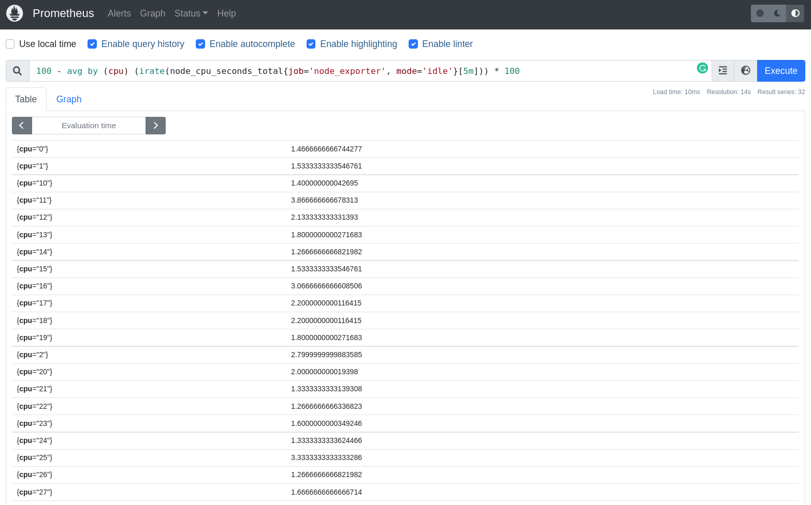

# Descomplicando o Prometheus

## DAY-3


### O que iremos ver hoje?

Durante o nosso terceiro dia nessa jornada do conhecimento em relação ao Prometheus, vamos entender e aprender como construir um exporter, o nosso segundo exporter, e dessa vez em Go.
Vamos aprender muito sobre operadores, como o `and` e o `or`, e como podemos utilizar esses operadores para criar queries mais complexas e que nos ajudem a entender melhor o que está acontecendo com nossos serviços.
Vamos ainda aprender muito sobre o sensacional Node Exporter, como configura-lo e consultar as métricas que ele nos disponibiliza.
E claro, realizar algumas queries durante o dia de hoje, somente para não perder o costume.
Ahhh, já vamos deixar o Grafana instalado e configurado para que possamos utiliza-lo durante o Day-4. Vamos instalar hoje, no Day-3, somente para deixa-lo um pouco mais ansioso para o nosso próximo dia de aprendizado. :D


&nbsp;

### Conteúdo do Day-3

<details>
<summary class="summary">DAY-3</summary>

- [Descomplicando o Prometheus](#descomplicando-o-prometheus)
  - [DAY-3](#day-3)
    - [O que iremos ver hoje?](#o-que-iremos-ver-hoje)
    - [Conteúdo do Day-3](#conteúdo-do-day-3)
    - [Criando o nosso segundo exporter](#criando-o-nosso-segundo-exporter)
      - [Criando o nosso exporter usando Go](#criando-o-nosso-exporter-usando-go)
      - [Adicionando o nosso exporter no container](#adicionando-o-nosso-exporter-no-container)
      - [Adicionando o novo Target no Prometheus](#adicionando-o-novo-target-no-prometheus)
    - [As Funções](#as-funções)
      - [A função *rate*](#a-função-rate)
      - [A função *irate*](#a-função-irate)
      - [A função *delta*](#a-função-delta)
      - [A função *increase*](#a-função-increase)
      - [A função *sum*](#a-função-sum)
      - [A função *count*](#a-função-count)
      - [A função *avg*](#a-função-avg)
      - [A função *min*](#a-função-min)
      - [A função *max*](#a-função-max)
      - [A função *avg\_over\_time*](#a-função-avg_over_time)
      - [A função *sum\_over\_time*](#a-função-sum_over_time)
      - [A função *max\_over\_time*](#a-função-max_over_time)
      - [A função *min\_over\_time*](#a-função-min_over_time)
      - [A função *stddev\_over\_time*](#a-função-stddev_over_time)
      - [A função *by*](#a-função-by)
      - [A função *without*](#a-função-without)
      - [A função *histogram\_quantile e quantile*](#a-função-histogram_quantile-e-quantile)
    - [Praticando e usando as funções](#praticando-e-usando-as-funções)
    - [Operadores](#operadores)
      - [Operador de igualdade](#operador-de-igualdade)
      - [Operador de diferença](#operador-de-diferença)
      - [Operador de maior que](#operador-de-maior-que)
      - [Operador de menor que](#operador-de-menor-que)
      - [Operador de maior ou igual que](#operador-de-maior-ou-igual-que)
      - [Operador de menor ou igual que](#operador-de-menor-ou-igual-que)
      - [Operador de multiplicação](#operador-de-multiplicação)
      - [Operador de divisão](#operador-de-divisão)
      - [Operador de adição](#operador-de-adição)
      - [Operador de subtração](#operador-de-subtração)
      - [Operador de modulo](#operador-de-modulo)
      - [Operador de potenciação](#operador-de-potenciação)
      - [Operador de agrupamento](#operador-de-agrupamento)
      - [Operador de concatenação](#operador-de-concatenação)
      - [Operador de comparação de strings](#operador-de-comparação-de-strings)
      - [Chega de operadores por hoje](#chega-de-operadores-por-hoje)
    - [O Node Exporter](#o-node-exporter)
      - [Os Collectors](#os-collectors)
      - [Instalação do Node Exporter no Linux](#instalação-do-node-exporter-no-linux)
      - [Adicionando o Node Exporter no Prometheus](#adicionando-o-node-exporter-no-prometheus)
    - [Habilitando novos collectors no Node Exporter](#habilitando-novos-collectors-no-node-exporter)
    - [Algumas queries capturando métricas do Node Exporter](#algumas-queries-capturando-métricas-do-node-exporter)
    - [Chega por hoje!](#chega-por-hoje)
    - [Lição de casa](#lição-de-casa)
    - [Referências](#referências)

</details>

&nbsp;
&nbsp;

### Criando o nosso segundo exporter

Agora que já vimos como criar um exporter, vamos criar um segundo exporter para monitorar o consumo de memória do nosso servidor.

Hoje vamos criar um exporter em Go, então antes de mais nada temos que instalar o Go em nossa máquina.

Para instalar o Go no Ubuntu, basta executar o seguinte comando:

```bash
sudo apt install golang
```

&nbsp;


Veja no site oficial do Go como instalar em outras distribuições.

#### Criando o nosso exporter usando Go

Vamos criar um arquivo chamado `segundo-exporter.go` no diretório `segundo-exporter` e vamos adicionar o seguinte código:

```GO
package main

import ( // importando as bibliotecas necessárias
	"log"      // log
	"net/http" // http

	"github.com/pbnjay/memory"                                // biblioteca para pegar informações de memória
	"github.com/prometheus/client_golang/prometheus"          // biblioteca para criar o nosso exporter
	"github.com/prometheus/client_golang/prometheus/promhttp" // biblioteca criar o servidor web
)

func memoriaLivre() float64 { // função para pegar a memória livre
	memoria_livre := memory.FreeMemory() // pegando a memória livre através da função FreeMemory() da biblioteca memory
	return float64(memoria_livre)        // retornando o valor da memória livre
}

func totalMemory() float64 { // função para pegar a memória total
	memoria_total := memory.TotalMemory() // pegando a memória total através da função TotalMemory() da biblioteca memory
	return float64(memoria_total)         // retornando o valor da memória total
}

var ( // variáveis para definir as nossas métricas do tipo Gauge
	memoriaLivreBytesGauge = prometheus.NewGauge(prometheus.GaugeOpts{ // métrica para pegar a memória livre em bytes
		Name: "memoria_livre_bytes",                  // nome da métrica
		Help: "Quantidade de memória livre em bytes", // descrição da métrica
	})

	memoriaLivreMegabytesGauge = prometheus.NewGauge(prometheus.GaugeOpts{ // métrica para pegar a memória livre em megabytes
		Name: "memoria_livre_megabytes",                  // nome da métrica
		Help: "Quantidade de memória livre em megabytes", // descrição da métrica
	})

	totalMemoryBytesGauge = prometheus.NewGauge(prometheus.GaugeOpts{ // métrica para pegar a memória total em bytes
		Name: "total_memoria_bytes",                  // nome da métrica
		Help: "Quantidade total de memória em bytes", // descrição da métrica
	})

	totalMemoryGigaBytesGauge = prometheus.NewGauge(prometheus.GaugeOpts{ // métrica para pegar a memória total em gigabytes
		Name: "total_memoria_gigabytes",                  // nome da métrica
		Help: "Quantidade total de memória em gigabytes", // descrição da métrica
	})
)

func init() { // função para registrar as métricas

	prometheus.MustRegister(memoriaLivreBytesGauge)     // registrando a métrica de memória livre em bytes
	prometheus.MustRegister(memoriaLivreMegabytesGauge) // registrando a métrica de memória livre em megabytes
	prometheus.MustRegister(totalMemoryBytesGauge)      // registrando a métrica de memória total em bytes
	prometheus.MustRegister(totalMemoryGigaBytesGauge)  // registrando a métrica de memória total em gigabytes
}

func main() { // função principal
	memoriaLivreBytesGauge.Set(memoriaLivre())                        // setando o valor da métrica de memória livre em bytes
	memoriaLivreMegabytesGauge.Set(memoriaLivre() / 1024 / 1024)      // setando o valor da métrica de memória livre em megabytes
	totalMemoryBytesGauge.Set(totalMemory())                          // setando o valor da métrica de memória total em bytes
	totalMemoryGigaBytesGauge.Set(totalMemory() / 1024 / 1024 / 1024) // setando o valor da métrica de memória total em gigabytes

	http.Handle("/metrics", promhttp.Handler()) // criando o servidor web para expor as métricas

	log.Fatal(http.ListenAndServe(":7788", nil)) // iniciando o servidor web na porta 7788
}
```

&nbsp;


O código acima está todo comentado explicando o que cada linha faz, então não vou me estender muito explicando o código.

Mas básicamente estamos criando um exporter que vai expor 4 métricas:

* `memoria_livre_bytes` - métrica que vai retornar a quantidade de memória livre em bytes
* `memoria_livre_megabytes` - métrica que vai retornar a quantidade de memória livre em megabytes
* `total_memoria_bytes` - métrica que vai retornar a quantidade total de memória em bytes
* `total_memoria_gigabytes` - métrica que vai retornar a quantidade total de memória em gigabytes

&nbsp;

Lembrando que estamos utilizando os pacotes `prometheus` para criar o nosso exporter e `promhttp` para expor as métricas através de um servidor web.
Também estamos utilizando o pacote `memory` para pegar as informações de memória do nosso servidor, valeu usuário do GitHub *pbnjay* por criar essa biblioteca.

Estamos utilizando o pacote `log` para logar os erros que possam acontecer e o pacote `net/http` para criar o webserver.

&nbsp;


Agora vamos compilar o nosso código e executar o nosso exporter, mas antes precisamos instalar as bibliotecas que utilizamos em nosso código.

```BASH
go mod init segundo-exporter
go mod tidy
```

Agora sim já podemos compilar o nosso código conforme o exemplo abaixo:

```BASH
go build segundo-exporter.go
```

Perceba que foi gerado um binário Go chamado `segundo-exporter`, vamos executa-lo:

```BASH
./segundo-exporter
```

&nbsp;

Nós configuramos o web server do nosso exporter para rodar na porta 7788, vamos acessar a URL `http://localhost:7788/metrics` para ver as métricas que o nosso exporter está exportando.

Você pode verificar as métricas atráves do navegador ou utilizando o comando `curl`:

```BASH
curl http://localhost:7788/metrics
```

&nbsp;

A saída deve ser algo parecido com o exemplo abaixo:

```BASH
# HELP go_gc_duration_seconds A summary of the pause duration of garbage collection cycles.
# TYPE go_gc_duration_seconds summary
go_gc_duration_seconds{quantile="0"} 4.4072e-05
go_gc_duration_seconds{quantile="0.25"} 4.4072e-05
go_gc_duration_seconds{quantile="0.5"} 8.7174e-05
go_gc_duration_seconds{quantile="0.75"} 8.7174e-05
go_gc_duration_seconds{quantile="1"} 8.7174e-05
go_gc_duration_seconds_sum 0.000131246
go_gc_duration_seconds_count 2
# HELP go_goroutines Number of goroutines that currently exist.
# TYPE go_goroutines gauge
go_goroutines 8
# HELP go_info Information about the Go environment.
# TYPE go_info gauge
go_info{version="go1.18.1"} 1
# HELP go_memstats_alloc_bytes Number of bytes allocated and still in use.
# TYPE go_memstats_alloc_bytes gauge
go_memstats_alloc_bytes 4.69292e+06
# HELP go_memstats_alloc_bytes_total Total number of bytes allocated, even if freed.
# TYPE go_memstats_alloc_bytes_total counter
go_memstats_alloc_bytes_total 6.622168e+06
# HELP go_memstats_buck_hash_sys_bytes Number of bytes used by the profiling bucket hash table.
# TYPE go_memstats_buck_hash_sys_bytes gauge
go_memstats_buck_hash_sys_bytes 4248
# HELP go_memstats_frees_total Total number of frees.
# TYPE go_memstats_frees_total counter
go_memstats_frees_total 6221
# HELP go_memstats_gc_sys_bytes Number of bytes used for garbage collection system metadata.
# TYPE go_memstats_gc_sys_bytes gauge
go_memstats_gc_sys_bytes 4.709704e+06
# HELP go_memstats_heap_alloc_bytes Number of heap bytes allocated and still in use.
# TYPE go_memstats_heap_alloc_bytes gauge
go_memstats_heap_alloc_bytes 4.69292e+06
# HELP go_memstats_heap_idle_bytes Number of heap bytes waiting to be used.
# TYPE go_memstats_heap_idle_bytes gauge
go_memstats_heap_idle_bytes 2.392064e+06
# HELP go_memstats_heap_inuse_bytes Number of heap bytes that are in use.
# TYPE go_memstats_heap_inuse_bytes gauge
go_memstats_heap_inuse_bytes 5.24288e+06
# HELP go_memstats_heap_objects Number of allocated objects.
# TYPE go_memstats_heap_objects gauge
go_memstats_heap_objects 22935
# HELP go_memstats_heap_released_bytes Number of heap bytes released to OS.
# TYPE go_memstats_heap_released_bytes gauge
go_memstats_heap_released_bytes 1.662976e+06
# HELP go_memstats_heap_sys_bytes Number of heap bytes obtained from system.
# TYPE go_memstats_heap_sys_bytes gauge
go_memstats_heap_sys_bytes 7.634944e+06
# HELP go_memstats_last_gc_time_seconds Number of seconds since 1970 of last garbage collection.
# TYPE go_memstats_last_gc_time_seconds gauge
go_memstats_last_gc_time_seconds 1.6623888726616032e+09
# HELP go_memstats_lookups_total Total number of pointer lookups.
# TYPE go_memstats_lookups_total counter
go_memstats_lookups_total 0
# HELP go_memstats_mallocs_total Total number of mallocs.
# TYPE go_memstats_mallocs_total counter
go_memstats_mallocs_total 29156
# HELP go_memstats_mcache_inuse_bytes Number of bytes in use by mcache structures.
# TYPE go_memstats_mcache_inuse_bytes gauge
go_memstats_mcache_inuse_bytes 38400
# HELP go_memstats_mcache_sys_bytes Number of bytes used for mcache structures obtained from system.
# TYPE go_memstats_mcache_sys_bytes gauge
go_memstats_mcache_sys_bytes 46800
# HELP go_memstats_mspan_inuse_bytes Number of bytes in use by mspan structures.
# TYPE go_memstats_mspan_inuse_bytes gauge
go_memstats_mspan_inuse_bytes 107712
# HELP go_memstats_mspan_sys_bytes Number of bytes used for mspan structures obtained from system.
# TYPE go_memstats_mspan_sys_bytes gauge
go_memstats_mspan_sys_bytes 114240
# HELP go_memstats_next_gc_bytes Number of heap bytes when next garbage collection will take place.
# TYPE go_memstats_next_gc_bytes gauge
go_memstats_next_gc_bytes 5.281792e+06
# HELP go_memstats_other_sys_bytes Number of bytes used for other system allocations.
# TYPE go_memstats_other_sys_bytes gauge
go_memstats_other_sys_bytes 1.43568e+06
# HELP go_memstats_stack_inuse_bytes Number of bytes in use by the stack allocator.
# TYPE go_memstats_stack_inuse_bytes gauge
go_memstats_stack_inuse_bytes 688128
# HELP go_memstats_stack_sys_bytes Number of bytes obtained from system for stack allocator.
# TYPE go_memstats_stack_sys_bytes gauge
go_memstats_stack_sys_bytes 688128
# HELP go_memstats_sys_bytes Number of bytes obtained from system.
# TYPE go_memstats_sys_bytes gauge
go_memstats_sys_bytes 1.4633744e+07
# HELP go_threads Number of OS threads created.
# TYPE go_threads gauge
go_threads 13
# HELP memoria_livre_bytes Quantidade de memória livre em bytes
# TYPE memoria_livre_bytes gauge
memoria_livre_bytes 5.0984931328e+10
# HELP memoria_livre_megabytes Quantidade de memória livre em megabytes
# TYPE memoria_livre_megabytes gauge
memoria_livre_megabytes 48623.01953125
# HELP process_cpu_seconds_total Total user and system CPU time spent in seconds.
# TYPE process_cpu_seconds_total counter
process_cpu_seconds_total 0.02
# HELP process_max_fds Maximum number of open file descriptors.
# TYPE process_max_fds gauge
process_max_fds 1.048576e+06
# HELP process_open_fds Number of open file descriptors.
# TYPE process_open_fds gauge
process_open_fds 35
# HELP process_resident_memory_bytes Resident memory size in bytes.
# TYPE process_resident_memory_bytes gauge
process_resident_memory_bytes 1.4884864e+07
# HELP process_start_time_seconds Start time of the process since unix epoch in seconds.
# TYPE process_start_time_seconds gauge
process_start_time_seconds 1.66238886841e+09
# HELP process_virtual_memory_bytes Virtual memory size in bytes.
# TYPE process_virtual_memory_bytes gauge
process_virtual_memory_bytes 1.494904832e+09
# HELP process_virtual_memory_max_bytes Maximum amount of virtual memory available in bytes.
# TYPE process_virtual_memory_max_bytes gauge
process_virtual_memory_max_bytes 1.8446744073709552e+19
# HELP promhttp_metric_handler_requests_in_flight Current number of scrapes being served.
# TYPE promhttp_metric_handler_requests_in_flight gauge
promhttp_metric_handler_requests_in_flight 1
# HELP promhttp_metric_handler_requests_total Total number of scrapes by HTTP status code.
# TYPE promhttp_metric_handler_requests_total counter
promhttp_metric_handler_requests_total{code="200"} 6
promhttp_metric_handler_requests_total{code="500"} 0
promhttp_metric_handler_requests_total{code="503"} 0
# HELP total_memoria_bytes Quantidade total de memória em bytes
# TYPE total_memoria_bytes gauge
total_memoria_bytes 6.7332653056e+10
# HELP total_memoria_gigabytes Quantidade total de memória em gigabytes
# TYPE total_memoria_gigabytes gauge
total_memoria_gigabytes 62.70841979980469
```

Perceba que as nossas métricas estão lá, são elas:

  * `memoria_livre_bytes`
  * `memoria_livre_megabytes`
  * `total_memoria_bytes`
  * `total_memoria_gigabytes`

Está funcionando lindamente.


#### Adicionando o nosso exporter no container

Agora vamos adicionar o nosso segundo exporter em um outro container, para isso vamos criar um arquivo chamado `Dockerfile` no diretório `segundo-exporter` com o seguinte conteúdo:

```dockerfile
FROM golang:1.19.0-alpine3.16 AS buildando

WORKDIR /app
COPY . /app
RUN go build segundo-exporter.go

FROM alpine:3.16
LABEL maintainer Jeferson Fernando <jeferson@linuxtips.com.br>
LABEL description "Executando o nosso segundo exporter"
COPY --from=buildando /app/segundo-exporter /app/segundo-exporter
EXPOSE 7788
WORKDIR /app
CMD ["./segundo-exporter"]
```

&nbsp;

Agora vamos buildar a imagem do nosso segundo exporter, para isso vamos executar o seguinte comando:

```bash
docker build -t segundo-exporter:1.0 .
```

&nbsp;

Vamos listar a nossa nova imagem de container com o nosso segundo exporter:

```bash
docker images | grep segundo-exporter
```

&nbsp;

Muito bom, está lá, agora vamos executar o nosso segundo exporter:

```bash
docker run -d --name segundo-exporter -p 7788:7788 segundo-exporter:1.0
```

&nbsp;

Agora vamos listar os nossos containers em execução:

```bash
docker ps
```

&nbsp;

Ele está lá:
  
  ```bash
CONTAINER ID   IMAGE                  COMMAND                CREATED         STATUS         PORTS                                       NAMES
e51e819c6069   segundo-exporter:1.0   "./segundo-exporter"   6 seconds ago   Up 5 seconds   0.0.0.0:7788->7788/tcp, :::7788->7788/tcp   segundo-exporter
```

&nbsp;

Vamos acessar as métricas do nosso segundo exporter:

```bash
curl http://localhost:7788/metrics
```
&nbsp;

Tudo funcionando maravilhosamente bem!

#### Adicionando o novo Target no Prometheus

Agora já podemos configurar o Prometheus para monitorar o nosso segundo exporter. Para isso temos que editar o arquivo `prometheus.yml` e adicionar o seguinte conteúdo:

```yaml
global:
  scrape_interval: 15s
  evaluation_interval: 15s

rule_files:
scrape_configs:
  - job_name: "prometheus"
    static_configs:
      - targets: ["localhost:9090"]

  - job_name: "Meu Primeiro Exporter"
    static_configs:
      - targets: ["localhost:8899"]
  
  - job_name: 'segundo-exporter'
    static_configs:
      - targets: ['localhost:7788']
```

&nbsp;

Pronto, agora vamos fazer o restart do Prometheus para que ele carregue as novas configurações:

```bash
systemctl restart prometheus
```

&nbsp;

Vocês também pode fazer isso via comando kill, mas o restart é mais gostosinho de ai meu dels.

```bash
kill -HUP $(pidof prometheus)
```

&nbsp;

Agora vamos acessar o Prometheus e verificar se o novo target e as nossas novas métricas estão por lá:

```bash
http://localhost:9090
```
&nbsp;

O nosso novo target está lá:


&nbsp;

E as nossa novas métricas também:


&nbsp;


&nbsp;
&nbsp;

### As Funções

Uma coisa muito importante é se sentir confortável com o uso da PromQL, pois é com ela que iremos extrair o máximo de nossas métricas e também do mundo sensacional das `time series`.

Vamos conhecer algumas funções para criação de queries mais efetivas. Vou listar algumas e outras funções vamos conhecendo conforme vamos avançando.

&nbsp;
&nbsp;

#### A função *rate*

A função `rate` representa a taxa de crescimento por segundo de uma determinada métrica como média, durante um intervalo de tempo.

```PROMQL
rate(metrica)[5m]
```
&nbsp;
Onde `metrica` é a métrica que você deseja calcular a taxa de crescimento durante um intervalo de tempo de 5 minutos. Você pode utilizar a função `rate` para trabalhar com métricas do tipo `gauge` e `counter`.

Vamos para um exemplo real:

```PROMQL
rate(prometheus_http_requests_total{job="prometheus",handler="/api/v1/query"}[5m])
```

&nbsp;

Aqui estou calculando a média da taxa de crescimento por segundo da métrica `prometheus_http_requests_total`, filtrando por `job` e `handler` e durante um intervalo de tempo de 5 minutos. Nesse caso eu quero saber o crescimento nas queries que estão sendo feitas no Prometheus.

&nbsp;
&nbsp;


#### A função *irate*

A função `irate` representa a taxa de crescimento por segundo de uma determinada métrica, mas diferentemente da função `rate`, a função `irate` não faz a média dos valores, ela pega os dois últimos pontos e calcula a taxa de crescimento. Quando representado em um gráfico, é possível ver a diferença entre a função `rate` e a função `irate`, enquanto o gráfico com o `rate` é mais suave, o gráfico com o `irate` é mais "pontiagudo", você consegue ver quedas e subidas mais nítidas.


```PROMQL
irate(metrica[5m])
```
&nbsp;

Onde `metrica` é a métrica que você deseja calcular a taxa de crescimento, considerando somente os dois últimos pontos, durante um intervalo de tempo de 5 minutos.

Vamos para um exemplo real:

```PROMQL
irate(prometheus_http_requests_total{job="prometheus",handler="/api/v1/query"}[5m])
```

&nbsp;

Aqui estou calculando a taxa de crescimento por segundo da métrica `prometheus_http_requests_total`, considerando somente os dois últimos pontos, filtrando por `job` e `handler` e durante um intervalo de tempo de 5 minutos. Nesse caso eu quero saber o crescimento nas queries que estão sendo feitas no Prometheus.

&nbsp;
&nbsp;

#### A função *delta*

A função `delta` representa a diferença entre o valor atual e o valor anterior de uma métrica. Quando estamos falando de `delta` estamos falando por exemplo do consumo de um disco. Vamos imaginar que eu queira saber o quando eu usei de disco em um determinado intervalo de tempo, eu posso utilizar a função `delta` para calcular a diferença entre o valor atual e o valor anterior. 

```PROMQL
delta(metrica[5m])
```
&nbsp;

Onde `metrica` é a métrica que você deseja calcular a diferença entre o valor atual e o valor anterior, durante um intervalo de tempo de 5 minutos.

&nbsp;

Vamos para um exemplo real:

```PROMQL
delta(prometheus_http_response_size_bytes_count{job="prometheus",handler="/api/v1/query"}[5m])
```

Agora estou calculando a diferença entre o valor atual e o valor anterior da métrica `prometheus_http_response_size_bytes_count`, filtrando por `job` e `handler` e durante um intervalo de tempo de 5 minutos. Nesse caso eu quero saber o quanto de bytes eu estou consumindo nas queries que estão sendo feitas no Prometheus.


&nbsp;
&nbsp;

#### A função *increase*

Da mesma forma que a função `delta`, a função `increase` representa a diferença entre o primeiro e último valor durante um intervalo de tempo, porém a diferença é que a função `increase` considera que o valor é um contador, ou seja, o valor é incrementado a cada vez que a métrica é atualizada.
Ela começa com o valor 0 e vai somando o valor da métrica a cada atualização.
Você já pode imaginar qual o tipo de métrica que ela trabalha, certo? 
Qual? Counter!

```PROMQL
increase(metrica[5m])
```

&nbsp;

Onde `metrica` é a métrica que você deseja calcular a diferença entre o primeiro e último valor durante um intervalo de tempo de 5 minutos.

&nbsp;

Vamos para um exemplo real:

```PROMQL
increase(prometheus_http_requests_total{job="prometheus",handler="/api/v1/query"}[5m])
```

&nbsp;

Aqui estou calculando a diferença entre o primeiro e último valor da métrica `prometheus_http_requests_total`, filtrando por `job` e `handler` e durante um intervalo de tempo de 5 minutos.

Você pode acompanhar o resultado dessa query clicando em `Graph` e depois em `Execute`, assim você vai ver o gráfico com o resultado da query fazendo mais sentindo.

&nbsp;
&nbsp;

#### A função *sum*

A função `sum` representa a soma de todos os valores de uma métrica. 
Você pode utilizar a função `sum` nos tipos de dados `counter`, `gauge`, `histogram` e `summary`.
Um exemplo de uso da função `sum` é quando você quer saber o quanto de memória está sendo utilizada por todos os seus containers, ou o quanto de memória está sendo utilizada por todos os seus pods.

```PROMQL
sum(metrica)
```

&nbsp;

Onde `metrica` é a métrica que você deseja somar.

&nbsp;

Vamos para um exemplo real:

```PROMQL
sum(go_memstats_alloc_bytes{job="prometheus"})
```

&nbsp;

Aqui estou somando todos os valores da métrica `go_memstats_alloc_bytes`, filtrando por `job` e durante um intervalo de tempo de 5 minutos.

&nbsp;
&nbsp;

#### A função *count*

Outra função bem utilizada é função `count` representa o contador de uma métrica.
Você pode utilizar a função `count` nos tipos de dados `counter`, `gauge`, `histogram` e `summary`.
Um exemplo de uso da função `count` é quando você quer saber quantos containers estão rodando em um determinado momento ou quantos de seus pods estão em execução.
  
```PROMQL
count(metrica)
```

&nbsp;

Onde `metrica` é a métrica que você deseja contar.

&nbsp;

Vamos para um exemplo real:

```PROMQL
count(prometheus_http_requests_total)
```

&nbsp;

Teremos como resultado o número de valores que a métrica `prometheus_http_requests_total` possui.

&nbsp;
&nbsp;

#### A função *avg*

A função `avg` representa o valor médio de uma métrica.
Você pode utilizar a função `avg` nos tipos de dados `counter`, `gauge`, `histogram` e `summary`.
Essa é uma das funções mais utilizadas, pois é muito comum você querer saber o valor médio de uma métrica, por exemplo, o valor médio de memória utilizada por um container.

```PROMQL
avg(metrica)
```

&nbsp;

Onde `metrica` é a métrica que você deseja calcular a média.

&nbsp;
&nbsp;

#### A função *min*

A função `min` representa o valor mínimo de uma métrica.
Você pode utilizar a função `min` nos tipos de dados `counter`, `gauge`, `histogram` e `summary`.
Um exemplo de uso da função `min` é quando você quer saber qual o menor valor de memória utilizada por um container.

```PROMQL
min(metrica)
```

&nbsp;

Onde `metrica` é a métrica que você deseja calcular o mínimo.

&nbsp;
&nbsp;

#### A função *max*

A função `max` representa o valor máximo de uma métrica.
Um exemplo de uso da função `max` é quando você quer saber qual o maior valor de memória pelos nodes de um cluster Kubernetes.

```PROMQL
max(metrica)
```

&nbsp;

Onde `metrica` é a métrica que você deseja calcular o máximo.

&nbsp;
&nbsp;


#### A função *avg_over_time*

A função `avg_over_time` representa a média de uma métrica durante um intervalo de tempo.
Normalmente utilizada para calcular a média de uma métrica durante um intervalo de tempo, como por exemplo, a média de requisições por segundo durante um intervalo de tempo ou ainda as pessoas que estão no espaço durante o último ano. :D

```PROMQL
avg_over_time(metrica[5m])
```

&nbsp;

Onde `metrica` é a métrica que você deseja calcular a média durante um intervalo de tempo de 5 minutos.

&nbsp;

Vamos para um exemplo real:

```PROMQL
avg_over_time(prometheus_http_requests_total{handler="/api/v1/query"}[5m])
```

&nbsp;

Agora estou calculando a média da métrica `prometheus_http_requests_total`, filtrando por `handler` e durante um intervalo de tempo de 5 minutos.

&nbsp;
&nbsp;

#### A função *sum_over_time*

Também temos a função `sum_over_time`, que representa a soma de uma métrica durante um intervalo de tempo. Vimos a `avg_over_time` que representa a média, a `sum_over_time` representa a soma dos valores durante um intervalo de tempo.
Imagina calcular a soma de uma métrica durante um intervalo de tempo, como por exemplo, a soma de requisições por segundo durante um intervalo de tempo ou ainda a soma de pessoas que estão no espaço durante o último ano.

```PROMQL
sum_over_time(metrica[5m])
```

&nbsp;

Onde `metrica` é a métrica que você deseja calcular a soma durante um intervalo de tempo de 5 minutos.

&nbsp;

Vamos para um exemplo real:

```PROMQL
sum_over_time(prometheus_http_requests_total{handler="/api/v1/query"}[5m])
```

&nbsp;

Agora estou calculando a soma da métrica `prometheus_http_requests_total`, filtrando por `handler` e durante um intervalo de tempo de 5 minutos.

&nbsp;
&nbsp;

#### A função *max_over_time*

A função `max_over_time` representa o valor máximo de uma métrica durante um intervalo de tempo.

```PROMQL
max_over_time(metrica[5m])
```

&nbsp;

Onde `metrica` é a métrica que você deseja calcular o valor máximo durante um intervalo de tempo de 5 minutos.

&nbsp;

Vamos para um exemplo real:

```PROMQL
max_over_time(prometheus_http_requests_total{handler="/api/v1/query"}[5m])
```

&nbsp;

Agora estamos buscando o valor máximo da métrica `prometheus_http_requests_total`, filtrando por `handler` e durante um intervalo de tempo de 5 minutos.

&nbsp;
&nbsp;

#### A função *min_over_time*

A função `min_over_time` representa o valor mínimo de uma métrica durante um intervalo de tempo.

```PROMQL

min_over_time(metrica[5m])
```

&nbsp;

Onde `metrica` é a métrica que você deseja calcular o valor mínimo durante um intervalo de tempo de 5 minutos.

&nbsp;

Vamos para um exemplo real:

```PROMQL
min_over_time(prometheus_http_requests_total{handler="/api/v1/query"}[5m])
```

&nbsp;

Agora estamos buscando o valor mínimo da métrica `prometheus_http_requests_total`, filtrando por `handler` e durante um intervalo de tempo de 5 minutos.

&nbsp;
&nbsp;

#### A função *stddev_over_time*

A função `stddev_over_time` representa o desvio padrão, que são os valores que estão mais distantes da média, de uma métrica durante um intervalo de tempo.
Um bom exemplo seria para o calculo de desvio padrão para saber se houve alguma anomalia no consumo de disco, por exemplo.

```PROMQL
stddev_over_time(metrica[5m])
```

&nbsp;

Onde `metrica` é a métrica que você deseja calcular o desvio padrão durante um intervalo de tempo de 5 minutos.


&nbsp;

Vamos para um exemplo real:

```PROMQL
stddev_over_time(prometheus_http_requests_total{handler="/api/v1/query"}[10m])
```

&nbsp;

Agora estamos buscando os desvios padrões da métrica `prometheus_http_requests_total`, filtrando por `handler` e durante um intervalo de tempo de 10 minutos. Vale a pena verificar o gráfico, pois facilita a visualização dos valores.

&nbsp;
&nbsp;


#### A função *by*

A sensacional e super utilizada função `by` é utilizada para agrupar métricas. Com ela é possível agrupar métricas por labels, por exemplo, se eu quiser agrupar todas as métricas que possuem o label `job` eu posso utilizar a função `by` da seguinte forma:

```PROMQL
sum(metrica) by (job)
```

&nbsp;


Onde `metrica` é a métrica que você deseja agrupar e `job` é o label que você deseja agrupar.

&nbsp;

Vamos para um exemplo real:

```PROMQL
sum(prometheus_http_requests_total) by (code)
```

&nbsp;

Agora estamos somando a métrica `prometheus_http_requests_total` e agrupando por `code`, assim sabemos quantas requisições foram feitas por código de resposta.

&nbsp;
&nbsp;

#### A função *without*
A função `without` é utilizada para remover labels de uma métrica. 
Você pode utilizar a função `without` nos tipos de dados `counter`, `gauge`, `histogram` e `summary` e frequentemente usado em conjunto com a função `sum`.

```PROMQL
Por exemplo, se eu quiser remover o label `job` de uma métrica, eu posso utilizar a função `without` da seguinte forma:


```PROMQL
sum(metrica) without (job)
```

&nbsp;

Onde `metrica` é a métrica que você deseja remover o label `job`.

&nbsp;

Vamos para um exemplo real:

```PROMQL
sum(prometheus_http_requests_total) without (handler)
```

&nbsp;

Agora estamos somando a métrica `prometheus_http_requests_total` e removendo o label `handler`, assim sabemos quantas requisições foram feitas por código de resposta, sem saber qual handler foi utilizado para ter uma visão mais geral e focado no código de resposta.

&nbsp;
&nbsp;


#### A função *histogram_quantile e quantile*

As funções `histogram_quantile` e `quantile` são muito parecidas, porém a `histogram_quantile` é utilizada para calcular o percentil de uma métrica do tipo `histogram` e a `quantile` é utilizada para calcular o percentil de uma métrica do tipo `summary`.
Basicamente utilizamos esses funções para saber qual é o valor de uma métrica em um determinado percentil.

```PROMQL
quantile(0.95, metrica)
```

&nbsp;

Onde `metrica` é a métrica do tipo `histogram` que você deseja calcular o percentil e `0.95` é o percentil que você deseja calcular.

&nbsp;

Vamos para um exemplo real:

```PROMQL
quantile(0.95, prometheus_http_request_duration_seconds_bucket)
```

&nbsp;

Agora estamos calculando o percentil de 95% da métrica `prometheus_http_request_duration_seconds_bucket`, assim sabemos qual é o tempo de resposta de 95% das requisições.

&nbsp;
&nbsp;


### Praticando e usando as funções

Agora que já vimos a descrição de algumas funções, vamos começar a praticar e criar algumas queries utilizando as funções.

Vamos criar uma query para saber o quanto de cpu está sendo utilizado no nosso primeiro exporter durante cada execução.


```PROMQL
sum(rate(process_cpu_seconds_total{job="Primeiro Exporter"}[1m])) by (instance)
```
&nbsp;

Vamos entender melhor a query acima, o que ela faz?

  - Onde `sum(rate(process_cpu_seconds_total{job="Primeiro Exporter"}[1m]))` é a métrica que você deseja extrair.
  - Onde `by (instance)` é o agrupamento que você deseja fazer.

Ok, conseguimos dividir a query em duas partes, a primeira é a métrica e seus detalhes e a segunda é o agrupamento.

Agora vamos dividir a primeira um pouco mais.

```PROMQL
process_cpu_seconds_total{job="Primeiro Exporter"}[1m]
```
&nbsp;

Nessa primeira query, estamos pedindo o valor da métrica `process_cpu_seconds_total` no último 1 minuto.

O retorno são 04 valores, pois o scraping do Prometheus é feito em intervalos de 15 segundos.


&nbsp;


Maravilha, está rolando bem! 
Agora eu quero saber a média do consumo de cpu no nosso primeiro exporter durante o último 1 minuto.

```PROMQL
avg(rate(process_cpu_seconds_total{job="Primeiro Exporter"}[1m]))
```
&nbsp;


&nbsp;

Com isso nós temos a média do consumo de cpu no nosso primeiro exporter durante o último 1 minuto, e perceba que estamos utilizando a função `avg` para calcular a média, porém estamos também utilizando a função `rate`.
Precisamos do `rate` para calcular a taxa de aumento dos valores da métrica durante o último 1 minuto, conforme solicitado na query acima.

Agora vamos adicionar mais um detalhe a nossa query.

```PROMQL
by (instance)
```
&nbsp;

Então ela ficará assim:

```PROMQL
avg(rate(process_cpu_seconds_total{job="Primeiro Exporter"}[1m])) by (instance)
```
&nbsp;


&nbsp;

Com a função `by` adicionada, é possível agrupar os valores da métrica por um determinado campo, no nosso caso estamos agrupando por `instance`.

Em nosso exemplo somente temos uma instância no job `Primeiro Exporter`, então o agrupamente não tem efeito.

Mas se retirarmos da query o label `job`, o resultado trará também a instância do job `prometheus`.

```PROMQL
avg(rate(process_cpu_seconds_total[1m])) by (instance)
```
&nbsp;

Agora a saída trará também o valor da métrica para a instância do job `prometheus`.


&nbsp;


Caso queira pegar o menor valor da métrica registrada no último 1 minuto, basta utilizar a função `min`.

```PROMQL
min(rate(process_cpu_seconds_total[1m])) by (instance)
```
&nbsp;


&nbsp;


Caso queira pegar o maior valor da métrica registrada no último 1 minuto, basta utilizar a função `max`.

```PROMQL
max(rate(process_cpu_seconds_total[1m])) by (instance)
```
&nbsp;


&nbsp;


Eu falei bastante sobre as queries e os valores que elas retornam, porém eu nem falei ainda para vocês clicarem na aba `Graph` e ver os gráficos que são gerados automaticamente.

Vamos ver o gráfico da média do consumo de cpu pelos jobs durante o último 1 minuto.


&nbsp;
&nbsp;

### Operadores

Precisamos falar sobre os operadores, super importante para que possamos trazer ainda mais poder ao nosso querido PromQL e obter resultados ainda mais interessantes.

Vamos conhecer alguns! 

&nbsp;
&nbsp;

#### Operador de igualdade

O operador de igualdade é utilizado para comparar se dois valores são iguais. 

```PROMQL
metrica == 1
```

&nbsp;

Onde `metrica` é a métrica que você deseja comparar e `1` é o valor que você deseja comparar, logo se o valor da métrica for igual a 1, o resultado será verdadeiro.

&nbsp;
&nbsp;

#### Operador de diferença

O operador de diferença é utilizado para comparar se dois valores são diferentes. 

```PROMQL
metrica != 1
```

&nbsp;

Onde `metrica` é a métrica que você deseja comparar e `1` é o valor que você deseja comparar, logo se o valor da métrica for diferente de 1, o resultado será verdadeiro.


&nbsp;
&nbsp;

#### Operador de maior que

O operador de maior que é utilizado para comparar se um valor é maior que outro. 

```PROMQL
metrica > 1
```

&nbsp;

Onde `metrica` é a métrica que você deseja comparar e `1` é o valor que você deseja comparar, logo se o valor da métrica for maior que 1, o resultado será verdadeiro.

&nbsp;
&nbsp;

#### Operador de menor que

O operador de menor que é utilizado para comparar se um valor é menor que outro. 

```PROMQL
metrica < 1
```

&nbsp;

Onde `metrica` é a métrica que você deseja comparar e `1` é o valor que você deseja comparar, logo se o valor da métrica for menor que 1, o resultado será verdadeiro.

&nbsp;
&nbsp;

#### Operador de maior ou igual que

O operador de maior ou igual que é utilizado para comparar se um valor é maior ou igual que outro. 

```PROMQL
metrica >= 1
```

&nbsp;

Onde `metrica` é a métrica que você deseja comparar e `1` é o valor que você deseja comparar, logo se o valor da métrica for maior ou igual a 1, o resultado será verdadeiro.

&nbsp;
&nbsp;

#### Operador de menor ou igual que

O operador de menor ou igual que é utilizado para comparar se um valor é menor ou igual que outro. 

```PROMQL
metrica <= 1
```

&nbsp;

Onde `metrica` é a métrica que você deseja comparar e `1` é o valor que você deseja comparar, logo se o valor da métrica for menor ou igual a 1, o resultado será verdadeiro.


&nbsp;
&nbsp;

#### Operador de multiplicação

O operador de multiplicação é utilizado para multiplicar dois valores. 

```PROMQL
metrica * 1
```

&nbsp;

Onde `metrica` é a métrica que você deseja multiplicar e `1` é o valor que você deseja multiplicar, logo se o valor da métrica for multiplicado por 1, o resultado será o valor da métrica.

&nbsp;
&nbsp;

#### Operador de divisão

O operador de divisão é utilizado para dividir dois valores. 

```PROMQL
metrica / 1
```

&nbsp;

Onde `metrica` é a métrica que você deseja dividir e `1` é o valor pelo qual você deseja dividir a `metrica`. O resultado será o valor da métrica dividido pelo valor que você passou.

&nbsp;
&nbsp;

#### Operador de adição

O operador de adição é utilizado para somar dois valores. 

```PROMQL
metrica + 1
```

&nbsp;

Onde `metrica` é a métrica que você deseja somar e `1` é o valor que você deseja somar a `metrica`. O resultado será o valor da métrica somado ao valor que você passou.

&nbsp;
&nbsp;

#### Operador de subtração

O operador de subtração é utilizado para subtrair dois valores. 

```PROMQL
metrica - 1
```

&nbsp;

Onde `metrica` é a métrica que você deseja subtrair e `1` é o valor que você deseja subtrair da `metrica`. O resultado será o valor da métrica subtraído pelo valor que você passou.

&nbsp;
&nbsp;

#### Operador de modulo

O operador de modulo é utilizado para obter o resto da divisão de dois valores. 

```PROMQL
metrica % 1
```

&nbsp;

Onde `metrica` é a métrica que você deseja obter o resto da divisão e `1` é o valor pelo qual você deseja obter o resto da divisão da `metrica`. O resultado será o resto da divisão da métrica pelo valor que você passou.

&nbsp;
&nbsp;

#### Operador de potenciação

O operador de potenciação é utilizado para elevar um valor a uma potência. 

```PROMQL
metrica ^ 1
```

&nbsp;

Onde `metrica` é a métrica que você deseja elevar a uma potência e `1` é o valor que você deseja elevar a `metrica`. O resultado será o valor da métrica elevado ao valor que você passou.


&nbsp;
&nbsp;

#### Operador de agrupamento

O operador de agrupamento é utilizado para agrupar expressões. 

```PROMQL
(metrica + 1) / 2
```

&nbsp;

Perceba que o parenteses foi utilizado para agrupar a expressão `(metrica + 1)`. Onde `metrica` é a métrica que você deseja somar e `1` é o valor que você deseja somar a `metrica`. Essa parte da expressão será avaliada primeiro e o resultado será dividido por 2.

&nbsp;
&nbsp;


#### Operador de concatenação

O operador de concatenação é utilizado para concatenar strings. 

```PROMQL
"string_a" + "string_b"
```

&nbsp;

Onde `string_a` é a primeira string que você deseja concatenar e `string_b` é a segunda string que você deseja concatenar. O resultado será a concatenação das duas strings, ou seja, a primeira string seguida da segunda string.

&nbsp;
&nbsp;

#### Operador de comparação de strings

O operador de comparação de strings é utilizado para comparar se duas strings são iguais. 

```PROMQL
"string_a" == "string_b"
```

&nbsp;

Onde `string_a` é a primeira string que você deseja comparar e `string_b` é a segunda string que você deseja comparar. O resultado será verdadeiro se as duas strings forem iguais.

&nbsp;
&nbsp;

#### Chega de operadores por hoje

Conforme você for avançando nos estudos, você irá perceber que esses operadores são muito úteis para criar expressões mais complexas e que podem ser utilizadas para criar alertas mais precisos. Ainda temos alguns operadores que não foram abordados aqui, mas que você pode encontrar na documentação oficial do Prometheus e tbm no decorrer do treinamento.


&nbsp;
&nbsp;

### O Node Exporter	

Precisamos falar do exporter mais famoso do universo Prometheus, o sensacional Node Exporter. Com o Node Exporter você consegue coletar métricas de um servidor Linux ou em computadores MacOS, como por exemplo, o uso de CPU, disco, memória, open files, etc.

O Node Exporter é um projeto open source e escrito em Go. Ele é executado no Linux como um serviço e coleta e expõe as métricas do sistema operacional.

&nbsp;
&nbsp;

#### Os Collectors

O Node Exporter possui os `collectors` que são os responsáveis por capturar as métricas do sistema operacional. Por padrão, o Node Exporter vem com um monte de coletores habilitados, mas você pode habilitar outros, caso queira.

Para que você possa consultar a lista de `collectors` que vem habilitados por padrão, você pode acessar o link abaixo:

[Lista dos Collectors habilitados por padrão](https://github.com/prometheus/node_exporter#enabled-by-default)


&nbsp;

Temos ainda a lista com os `collectors` que estão desabilitados por padrão:

[Lista dos Collectors desabilitados por padrão](https://github.com/prometheus/node_exporter#disabled-by-default)

&nbsp;

Vou comentar de alguns `collectors` que são muito úteis:

* `arp`: Coleta métricas de ARP (Address Resolution Protocol) como por exemplo, o número de entradas ARP, o número de resoluções ARP, etc.
* `bonding`: Coleta métricas de interfaces em modo bonding.
* `conntrack`: Coleta métricas de conexões via Netfilter como por exemplo, o número de conexões ativas, o número de conexões que estão sendo rastreadas, etc.
* `cpu`: Coleta métricas de CPU.
* `diskstats`: Coleta métricas de IO de disco como por exemplo o número de leituras e escritas.
* `filefd`: Coleta métricas de arquivos abertos.
* `filesystem`: Coleta métricas de sistema de arquivos, como tamanho, uso, etc.
* `hwmon`: Coleta métricas de hardware como por exemplo a temperatura.
* `ipvs`: Coleta métricas de IPVS.
* `loadavg`: Coleta métricas de carga do sistema operacional.
* `mdadm`: Coleta métricas de RAID como por exemplo o número de discos ativos.
* `meminfo`: Coleta métricas de memória como por exemplo o uso de memória, o número de buffers, caches, etc.
* `netdev`: Coleta métricas de rede como por exemplo o número de pacotes recebidos e enviados.
* `netstat`: Coleta métricas de rede como por exemplo o número de conexões TCP e UDP.
* `os`: Coleta métricas de sistema operacional.
* `selinux`: Coleta métricas de SELinux como estado e políticas.
* `sockstat`: Coleta métricas de sockets.
* `stat`: Coleta métricas de sistema como uptime, forks, etc.
* `time`: Coleta métricas de tempo como sincronização de relógio.
* `uname`: Coleta métricas de informações.
* `vmstat`: Coleta métricas de memória virtual.

&nbsp;

Mais para frente vamos ver como habilitar ou desabilitar `collectors` no Node Exporter.

&nbsp;
&nbsp;

#### Instalação do Node Exporter no Linux

Vamos instalar o Node Exporter para que possamos ter ainda mais métricas para brincar com o nosso Prometheus, e claro, conhecer esse exporter que é praticamente a escolha padrão da maioria dos ambientes quando estamos falando de métricas de um servidor Linux.

O Node Exporter é um arquivo binário e que precisamos baixar do site oficial do projeto.

Abaixo segue a URL para download do Node Exporter:

```bash
https://prometheus.io/download/#node_exporter
```
&nbsp;

Acesse a URL e veja qual a última versão disponível para download. No momento em que escrevo esse mateira, a última versão disponível é a 1.3.1.

Vamos fazer o download do arquivo binário do Node Exporter:

```bash
wget https://github.com/prometheus/node_exporter/releases/download/v1.3.1/node_exporter-1.3.1.linux-amd64.tar.gz
```

&nbsp;

Com o arquivo já em nossa máquina, vamos descompactar-lo:

```bash
tar -xvzf node_exporter-1.3.1.linux-amd64.tar.gz
```

&nbsp;

Como falamos antes, o Node Exporter é apenas um binário Go, portanto é bem simples fazer a sua instalação em uma máquina Linux. Básicamente vamos seguir o mesmo processo que fizemos para instalar o Prometheus.

Bora mover o arquivo `node_exporter` para o diretório `/usr/local/bin`:

```bash
sudo mv node_exporter-1.3.1.linux-amd64/node_exporter /usr/local/bin/
```

&nbsp;

Vamos ver se está tudo ok com o nosso Node Exporter:

```bash
node_exporter --version
```

&nbsp;


A saída deve ser parecida com essa:


```bash
node_exporter, version 1.3.1 (branch: HEAD, revision: a2321e7b940ddcff26873612bccdf7cd4c42b6b6)
  build user:       root@243aafa5525c
  build date:       20211205-11:09:49
  go version:       go1.17.3
  platform:         linux/amd64
```

&nbsp;

Tudo em paz, vamos seguir com a instalação.


Vamos criar o usuário `node_exporter` para ser o responsável pela execução do serviço:

```bash
sudo addgroup --system node_exporter
sudo adduser --shell /sbin/nologin --system --group node_exporter
```

&nbsp;

Agora vamos criar o arquivo de configuração do serviço do Node Exporter para o Systemd:

```bash
sudo vim /etc/systemd/system/node_exporter.service
```

&nbsp;


Vamos adicionar o seguinte conteúdo:

```bash
[Unit] # Inicio do arquivo de configuração do serviço
Description=Node Exporter # Descrição do serviço
Wants=network-online.target # Define que o serviço depende da rede para iniciar
After=network-online.target # Define que o serviço deverá ser iniciado após a rede estar disponível

[Service] # Define as configurações do serviço
User=node_exporter # Define o usuário que irá executar o serviço
Group=node_exporter # Define o grupo que irá executar o serviço
Type=simple # Define o tipo de serviço
ExecStart=/usr/local/bin/node_exporter # Define o caminho do binário do serviço

[Install] # Define as configurações de instalação do serviço
WantedBy=multi-user.target # Define que o serviço será iniciado utilizando o target multi-user
```

&nbsp;

**Importante**: Não esqueça de tirar os comentários do arquivo de configuração do serviço, inclusive tem o arquivo sem comentários no repositório do Github do projeto.
Combinado?

&nbsp;

Como você já sabe, toda vez que adicionamos um novo serviço no Systemd, precisamos dar um reload para que o serviço seja reconhecido:

```bash
sudo systemctl daemon-reload
```

&nbsp;

E agora vamos iniciar o serviço:

```bash
sudo systemctl start node_exporter
```

&nbsp;

Precisamos ver se está tudo em paz com o nosso serviço:

```bash
sudo systemctl status node_exporter
```

&nbsp;


Como é bom ver essa saída sempre quando criamos e iniciamos um novo serviço:

```bash
     Loaded: loaded (/etc/systemd/system/node_exporter.service; disabled; vendor preset: enabled)
     Active: active (running) since Wed 2022-09-07 15:15:00 CEST; 3s ago
   Main PID: 50853 (node_exporter)
      Tasks: 6 (limit: 76911)
     Memory: 2.9M
        CPU: 5ms
     CGroup: /system.slice/node_exporter.service
             └─50853 /usr/local/bin/node_exporter
```

&nbsp;

O nosso querido e idolatrado Node Exporter está rodando. Agora vamos habilitar o serviço para que ele seja iniciado sempre que o servidor for reiniciado:

```bash
sudo systemctl enable node_exporter
```

&nbsp;

Importante mencionar que o nosso Node Exporter roda na porta 9100. Para acessar as métricas coletadas pelo Node Exporter, basta acessar a URL `http://<IP_DA_MAQUINA>:9100/metrics`.

Antes de ver as métricas, bora ver se o Node Exporter está utilizando a porta 9100.
Temos o comando `ss` que nos permite ver as conexões TCP e UDP que estão abertas em nossa máquina. Vamos usar esse comando para ver se o Node Exporter está escutando na porta 9100:

```bash
ss -atunp | grep 9100
```

&nbsp;

A saída deve ser parecida com essa:

```bash
tcp   LISTEN    0      4096                      *:9100                *:*                                       
```

&nbsp;

Muito bom! Está tudo certo com o nosso Node Exporter. Agora vamos ver as métricas coletadas por ele:

```bash
curl http://localhost:9100/metrics
```

&nbsp;

Lembre-se de mudar o `localhost` para o IP da sua máquina, caso tenha feito a instalação em outra máquina.

Voltando as métricas coletadas pelo Node Exporter, a saída é gigantesca, são mais de 2 mil métricas, muita coisa. hahaha


#### Adicionando o Node Exporter no Prometheus

Lembre-se que essas métricas ainda não estão no Prometheus. Para que elas estejam, precisamos configurar o Prometheus para coletar as métricas do Node Exporter, ou seja, configurar o Prometheus para fazer o `scrape` do Node Exporter, e para isso precisamos criar mais um `job` no arquivo de configuração do Prometheus para definir o nosso novo `target`.


Vamos adicionar o seguinte conteúdo no arquivo de configuração do Prometheus:

```bash
  - job_name: 'node_exporter'
	static_configs:
	  - targets: ['localhost:9100']
```

&nbsp;

**Importante**: Lembrando novamente para que você mude o `localhost` para o IP da sua máquina, caso tenha feito a instalação em outra máquina.

O arquivo deverá ficar assim:

```bash
global:
  scrape_interval: 15s
  evaluation_interval: 15s

rule_files:
scrape_configs:
  - job_name: "prometheus"
    static_configs:
      - targets: ["localhost:9090"]

  - job_name: "Meu Primeiro Exporter"
    static_configs:
      - targets: ["localhost:8899"]
  
  - job_name: 'segundo-exporter'
    static_configs:
      - targets: ['localhost:7788']

  - job_name: 'node_exporter'
	static_configs:
	  - targets: ['localhost:9100']
```

&nbsp;

Eu nem vou deixar o arquivo comentado aqui, pois você já sabe como funciona o arquivo de configuração do Prometheus, né? hahaha

Agora vamos reiniciar o Prometheus para que ele leia as novas configurações:

```bash
sudo systemctl restart prometheus
```

&nbsp;

Vamos ver se o nosso novo `job` foi criado com sucesso:

```bash
curl http://localhost:9090/targets
```

&nbsp;


Caso você queira ver o novo target via interface web do Prometheus, basta acessar a URL `http://localhost:9090/targets`. Se liga no print abaixo:


Está lá, o nosso novo `job` foi criado com sucesso. Agora vamos ver se o Prometheus está coletando as métricas do Node Exporter. Vamos passar o nome do `job` para o Prometheus, assim a nossa query ficará ainda mais específica:

```bash
curl -GET http://localhost:9090/api/v1/query --data-urlencode "query=node_cpu_seconds_total{job='node_exporter'}" | jq .
```

&nbsp;

A saída também é bastante grande, e a máquina que eu estou testando tem 32 CPUs, então vou colocar aqui aqui somente uma pequena parte da saída:

```json
{
  "status": "success",
  "data": {
    "resultType": "vector",
    "result": [
      {
        "metric": {
          "__name__": "node_cpu_seconds_total",
          "cpu": "0",
          "instance": "localhost:9100",
          "job": "node_exporter",
          "mode": "idle"
        },
        "value": [
          1662558580.478,
          "32077.95"
        ]
      },
      {
        "metric": {
          "__name__": "node_cpu_seconds_total",
          "cpu": "0",
          "instance": "localhost:9100",
          "job": "node_exporter",
          "mode": "iowait"
        },
        "value": [
          1662558580.478,
          "2.28"
        ]
      },
      {
```


Agora vamos fazer a mesma query, mas lá na interface web do Prometheus:


&nbsp;
&nbsp;


### Habilitando novos collectors no Node Exporter

Uma coisa bem interessante em relação ao Node Exporter é a quantidade de `collectors` que ele possui. Esses `collectors` são responsáveis por coletar as métricas de cada serviço que você quiser monitorar. Por exemplo, se você quiser monitorar os serviços que são gerenciados pelo `systemd`, você pode habilitar o `collector` do `systemd` no Node Exporter, vamos ver como fazer isso.

&nbsp;

Primeira coisa é criar um novo arquivo onde vamos colocar todas os `collectors` que queremos habilitar no Node Exporter, no nossa caso, somente o módulo do `systemd`. 

Vamos criar o arquivo `/etc/node_exporter/node_exporter_options` e o diretório `/etc/node_exporter/` caso ele não exista:


```bash
sudo mkdir /etc/node_exporter
sudo vim /etc/node_exporter/node_exporter_options
```

&nbsp;

Agora vamos adicionar a variável de ambiente `OPTIONS` no arquivo `/etc/node_exporter/node_exporter_options`:

```bash
OPTIONS="--collector.systemd"
```

&nbsp;

Vamos ajustar as permissões do arquivo `/etc/node_exporter/node_exporter_options`:

```bash
sudo chown -R node_exporter:node_exporter /etc/node_exporter/
```

&nbsp;


E no arquivo de configuração do serviço do Node Exporter para o SystemD, vamos adicionar a variável de ambiente `OPTIONS` e o arquivo vai ficar assim:

```bash
[Unit]
Description=Node Exporter
Wants=network-online.target
After=network-online.target

[Service]
User=node_exporter
Group=node_exporter
Type=simple
EnvironmentFile=/etc/node_exporter/node_exporter_options
ExecStart=/usr/local/bin/node_exporter $OPTIONS

[Install]
WantedBy=multi-user.target
```

&nbsp;

Pronto, adicionamos o nosso novo arquivo que contém a variável de ambiente `OPTIONS` e agora vamos reiniciar o serviço do Node Exporter para que ele leia as novas configurações:

```bash
sudo systemctl daemon-reload
sudo systemctl restart node_exporter
```

&nbsp;

Agora vamos ver se o Node Exporter está coletando as métricas do `systemd`:

```bash
curl -GET http://localhost:9100/metrics | grep systemd
```

&nbsp;

A saída é bem grande, então vou colocar aqui somente uma pequena parte da saída:

```bash
node_scrape_collector_success{collector="systemd"} 1
# HELP node_systemd_socket_accepted_connections_total Total number of accepted socket connections
# TYPE node_systemd_socket_accepted_connections_total counter
node_systemd_socket_accepted_connections_total{name="acpid.socket"} 0
node_systemd_socket_accepted_connections_total{name="apport-forward.socket"} 0
node_systemd_socket_accepted_connections_total{name="avahi-daemon.socket"} 0
node_systemd_socket_accepted_connections_total{name="cups.socket"} 0
node_systemd_socket_accepted_connections_total{name="dbus.socket"} 0
node_systemd_socket_accepted_connections_total{name="dm-event.socket"} 0
node_systemd_socket_accepted_connections_total{name="docker.socket"} 0
node_systemd_socket_accepted_connections_total{name="libvirtd-admin.socket"} 0
node_systemd_socket_accepted_connections_total{name="libvirtd-ro.socket"} 0
node_systemd_socket_accepted_connections_total{name="libvirtd.socket"} 0
node_systemd_socket_accepted_connections_total{name="lvm2-lvmpolld.socket"} 0
node_systemd_socket_accepted_connections_total{name="nordvpnd.socket"} 0
node_systemd_socket_accepted_connections_total{name="snapd.socket"} 0
node_systemd_socket_accepted_connections_total{name="syslog.socket"} 0
node_systemd_socket_accepted_connections_total{name="systemd-fsckd.socket"} 0

```

&nbsp;


Done! Tarefa concluída e super tranquilo de fazer. Agora você já sabe como habilitar novos `collectors` no Node Exporter e coletar novas métricas! \o/

&nbsp;
&nbsp;

### Algumas queries capturando métricas do Node Exporter

Agora que já sabemos como coletar as métricas do Node Exporter, vamos fazer algumas queries para capturar algumas métricas do Node Exporter.

&nbsp;

**1. Quantas CPU tem a minha máquina?**

```bash
count(node_cpu_seconds_total{job='node_exporter', mode='idle'})
```

&nbsp;


&nbsp;

Estamos pedindo o Prometheus para contar quantas métricas temos com o nome `node_cpu_seconds_total`, que estão associadas ao `job` `node_exporter` e que o `mode` é `idle`. O resultado é 32, ou seja, a minha máquina tem 32 CPUs.

Utilizei o modo `idle` para contar as CPUs. Cada CPU possui alguns modos, como `idle`, `iowait`, `irq`, `nice`, `softirq`, `steal`, `system` e `user`. Se eu não passasse o `mode` na query, o resultado seria 256, pois teríamos 32 CPUs e cada uma delas possui 8 modos. 

&nbsp;

Entendeu?

Você precisa ter criatividade no momento de criar as suas queries, e lembre-se, cada pessoa tem a sua lógica para criar as queries, mas o importante é você entender o que está fazendo e ter a busca constante da melhor e mais performática query, certo?

&nbsp;


**2. Qual a porcentagem de uso de CPU da minha máquina?**

```bash
100 - avg by (cpu) (irate(node_cpu_seconds_total{job='node_exporter', mode='idle'}[5m])) * 100
```

&nbsp;



&nbsp;

Estamos pedindo o Prometheus para calcular a média `avg` por `by` CPU `node_cpu_seconds_total`, que estão associadas as labels `job` `node_exporter` e que o `mode` é `idle`. O resultado será `100` menos `-` a média por CPU `avg by (cpu)` do uso de CPU `node_cpu_seconds_total`, que é calculado pela taxa de variação `irate` de 5 minutos `5m`.

Parece confuso quando escrito, eu sei. Mas vamos quebrar essa query em partes:

&nbsp;

Primeiro, vamos calcular a média por CPU do uso de CPU, que é calculado pela taxa de variação de 5 minutos:

```bash
avg by (cpu) (irate(node_cpu_seconds_total{job='node_exporter', mode='idle'}[5m]))
```

&nbsp;

Agora vamos multiplicar o resultado por 100, para que o resultado seja em porcentagem:

```bash
avg by (cpu) (irate(node_cpu_seconds_total{job='node_exporter', mode='idle'}[5m])) * 100
```

&nbsp;

E por fim, vamos subtrair o resultado de 100 para que o resultado seja a porcentagem de uso de CPU, pois o modo `idle` é o tempo que a CPU ficou ociosa e o que precisamos é o tempo que a CPU ficou em uso, por isso a subtração.

Por exemplo, se eu tenho 30% `idle`, então eu tenho 70% de uso de CPU. Entendeu?
Então se eu pegar o 100 e subtrair o 30, eu tenho 70, que é a porcentagem de uso de CPU. Agora você entendeu, vai!

Pronto, agora a query já está completa e totalmente explicada! 

&nbsp;

```bash
100 - avg by (cpu) (irate(node_cpu_seconds_total{job='node_exporter', mode='idle'}[5m])) * 100
```

&nbsp;

**3. Qual a porcentagem de uso de memória da minha máquina?**

```bash
100 - (node_memory_MemAvailable_bytes / node_memory_MemTotal_bytes) * 100
```

&nbsp;


&nbsp;

Estamos pedindo o Prometheus para calcular a porcentagem de uso de memória da minha máquina, que é calculado pela subtração de 100 menos a porcentagem de memória disponível `node_memory_MemAvailable_bytes` dividido pela memória total `node_memory_MemTotal_bytes` multiplicado por 100.

Parece confuso quando escrito, eu sei. Mas vamos quebrar essa query em partes:

&nbsp;

Primeiro é calculado o que está dentro dos parênteses, que é a porcentagem de memória disponível `node_memory_MemAvailable_bytes` dividido pela memória total `node_memory_MemTotal_bytes`:

```bash
node_memory_MemAvailable_bytes / node_memory_MemTotal_bytes
```

&nbsp;

Agora vamos multiplicar o resultado por 100, para que o resultado seja em porcentagem:

```bash
(node_memory_MemAvailable_bytes / node_memory_MemTotal_bytes) * 100
```

&nbsp;

E por fim, vamos subtrair o resultado de 100 para que o resultado seja a porcentagem de uso de memória, pois o que precisamos é o tempo que a memória ficou em uso, por isso a subtração.

Por exemplo, se eu tenho 30% `MemAvailable`, então eu tenho 70% de uso de memória. Mesmo esquema do exemplo anterior.

&nbsp;

```bash
100 - (node_memory_MemAvailable_bytes / node_memory_MemTotal_bytes) * 100
```

&nbsp;

**4. Qual a porcentagem de uso de disco da minha máquina?**

```bash
100 - (node_filesystem_avail_bytes{mountpoint="/"} / node_filesystem_size_bytes{mountpoint="/"}) * 100
```

&nbsp;


&nbsp;

Estamos pedindo o Prometheus para calcular a porcentagem de uso de disco da minha máquina, que é calculado pela subtração de 100 menos a porcentagem de disco disponível `node_filesystem_avail_bytes` dividido pelo tamanho total do disco `node_filesystem_size_bytes` multiplicado por 100.

Vamos deixar isso mais simples, vamos quebrar essa query:

&nbsp;

Primeiro é calculado o que está dentro dos parênteses, que é o espaço do disco disponível `node_filesystem_avail_bytes` dividido pelo tamanho total do disco `node_filesystem_size_bytes`:

```bash
node_filesystem_avail_bytes{mountpoint="/"} / node_filesystem_size_bytes{mountpoint="/"}
```

&nbsp;

Agora vamos multiplicar o resultado por 100, para que o resultado seja em porcentagem:

```bash
(node_filesystem_avail_bytes{mountpoint="/"} / node_filesystem_size_bytes{mountpoint="/"}) * 100
```

&nbsp;

E por fim, vamos subtrair o resultado de 100 para que o resultado seja a porcentagem de utilização do disco, por isso a subtração.


```bash
100 - (node_filesystem_avail_bytes{mountpoint="/"} / node_filesystem_size_bytes{mountpoint="/"}) * 100
```

&nbsp;

**5. Quanto de espaço está em uso na partição / em gigas?**

```bash
(node_filesystem_size_bytes{mountpoint="/"} - node_filesystem_avail_bytes{mountpoint="/"}) / 1024 / 1024 / 1024
```

&nbsp;


&nbsp;

Estamos pedindo o Prometheus para calcular o espaço em uso na partição `/` em gigas, que é calculado pela subtração do tamanho total do disco `node_filesystem_size_bytes` menos o espaço do disco disponível `node_filesystem_avail_bytes` dividido por 1024 (para converter para kilobytes), dividido por 1024 (para converter para megabytes) e dividido por 1024 (para converter para gigabytes), simples não?

Essa eu nem vou quebrar em partes, pois tenho certeza que você já entendeu como funciona.

&nbsp;
&nbsp;

### Chega por hoje!

Acho que já temos bastante conteúdo para hoje, então vamos parar por aqui. Já temos bastante conteúdo para você começar a brincar com o Prometheus e ter mais liberdade para criar as suas próprias queries e configurações.
Agora, precisamos muito que você pratique, que você olhe com carinho tudo o que você aprendeu hoje e que você coloque em prática, agora! Não deixe para amanhã o que você pode fazer hoje, não é mesmo? hahhahahah

&nbsp;
&nbsp;

### Lição de casa

Hoje a sua tarefa é praticar a criação de queries para extrair o máximo de informação do Node Exporter.
No final, você deve ter uma lista com as queries que você criou e que você entendeu como elas funcionam. A mesma coisa para as novas métricas que você conheceu, bora criar uma lista com as 5 mais legais que você encontrou e que você entendeu como elas funcionam.


&nbsp;
&nbsp;

### Referências

- [Prometheus - Querying](https://prometheus.io/docs/prometheus/latest/querying/basics/)
- [Prometheus - Querying - Functions](https://prometheus.io/docs/prometheus/latest/querying/functions/)
- [Prometheus - Querying - Operators](https://prometheus.io/docs/prometheus/latest/querying/operators/)