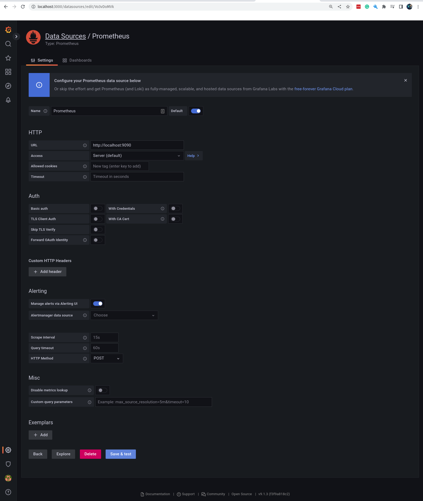
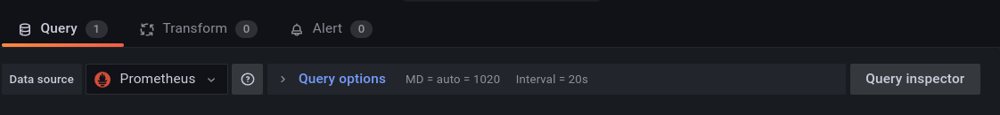

# Descomplicando o Prometheus

## DAY-4

### O que iremos ver hoje?

Uma das coisas mais sensacionais do Prometheus é a quantidade de integrações possíveis. Então hoje vai ser o dia onde nós iremos ver como fazer a integração do Prometheus com o Grafana e o Alertmanager.
Evidente, ainda vamos voltar nessas ferramentas muitas vezes no decorrer do treinamento, mas hoje é o dia de conhecermos como elas funcionam e como podemos integrar com o Prometheus.
&nbsp;

### Conteúdo do Day-4

<details>
<summary class="summary">DAY-4</summary>

- [Descomplicando o Prometheus](#descomplicando-o-prometheus)
  - [DAY-4](#day-4)
    - [O que iremos ver hoje?](#o-que-iremos-ver-hoje)
    - [Conteúdo do Day-4](#conteúdo-do-day-4)
    - [O Grafana](#o-grafana)
      - [Instalando o Grafana](#instalando-o-grafana)
      - [Adicionando o Prometheus como Data Source](#adicionando-o-prometheus-como-data-source)
      - [Criando o nosso primeiro Dashboard](#criando-o-nosso-primeiro-dashboard)
    - [Alertmanager](#alertmanager)
      - [Instalando o Alertmanager](#instalando-o-alertmanager)

</details>

&nbsp;

### O Grafana

O Grafana é uma ferramenta sensacional demais, impossível alguém não conhecer, e mais impossível ainda alguém não gostar.

Mas o que é esse tal de Grafana?

Te explico agora!

O Grafana é um projeto open source, e é mantido pela empresa Grafana Labs, empresa sueca e que hoje já possuem diferentes produtos, como o Grafana Cloud, Loki, Tempo, etc.


O Grafana é uma poderosa aplicação web que nos permite visualizar, em tempo real e com dashboards incríveis, os dados de diversas fontes, como por exemplo o Prometheus.

Basicamente o Grafana permite que você crie queries super elaboradas para consultar os dados em TSDBs, como o Prometheus, e depois criar dashboards e alertas incríveis.

O Grafa é uma ferramenta que eu uso muito, e que eu recomendo muito, mesmo que você não tenha o Prometheus, o Grafana pode usar dados de diversas fontes, como por exemplo o MySQL, o PostgreSQL, o MongoDB, etc.

Como falei, o Grafana não utiliza somente o Prometheus como fonte, como `datasource`, ele possui suporte a diferentes fontes de dados, como por exemplo:

- [Prometheus](https://grafana.com/grafana/plugins/grafana-prometheus-datasource)
- [InfluxDB](https://grafana.com/grafana/plugins/grafana-influxdb-datasource)
- [MySQL](https://grafana.com/grafana/plugins/grafana-mysql-datasource)
- [Postgres](https://grafana.com/grafana/plugins/grafana-postgres-datasource)
- [Elasticsearch](https://grafana.com/grafana/plugins/grafana-elasticsearch-datasource)
- [Google Cloud Monitoring](https://grafana.com/grafana/plugins/grafana-google-cloud-monitoring-datasource)
- [Azure Monitor](https://grafana.com/grafana/plugins/grafana-azure-monitor-datasource)
- [AWS CloudWatch](https://grafana.com/grafana/plugins/grafana-aws-cloudwatch-datasource)
- [OpenTSDB](https://grafana.com/grafana/plugins/grafana-opentsdb-datasource)

&nbsp;

Essas fontes de dados são chamadas de `datasources`, e o Grafana consegue se conectar a elas e obter os dados que precisamos, e assim ter as métricas que precisamos para montar os nossos dashboards.

O melhor de tudo, o Grafana trata esses `datasources` como plugins, então você pode criar o seu próprio `datasource` e utilizar no Grafana, caso ele não tenha suporte a alguma fonte de dados que você precise, ou até mesmo se você quiser criar um `datasource` para uma fonte de dados que você mesmo criou, sensacional né?

&nbsp;
&nbsp;

#### Instalando o Grafana

Vamos começar a nossa jornada na instalação do Grafana, nesse nosso primeiro exemplo vamos realizar a instalação do Grafana como um serviço no Linux, mas seguir a mesma lógica que usamos para instalar o nosso Prometheus.

Ainda vamos ver a instalação e configuração do Prometheus e do Grafana como containers rodando em nosso querido Kubernetes, pode ficar tranquila Pessoa_X!

Bem, vamos lá!

Primeira coisa que temos que fazer é visitar a documentação oficial do Grafana, e lá vamos encontrar a documentação para a sua instalação em diferentes sistemas operacionais, como por exemplo:

- [Instalação no Linux](https://grafana.com/docs/grafana/latest/installation/debian/)
- [Instalação no Windows](https://grafana.com/docs/grafana/latest/installation/windows/)
- [Instalação no Mac](https://grafana.com/docs/grafana/latest/installation/mac/)

Em nosso exemplo vamos instalar o Grafana no Linux, então vamos seguir a documentação para a instalação no Linux, que você pode acessar [aqui](https://grafana.com/docs/grafana/latest/installation/debian/).

&nbsp;

Para a nossa alegria, o Grafana disponibiliza um repositório para a instalação do Grafana no Linux, como por exemplo no Ubuntu, que estão utilizando desde o começo. :)

Primeira coisa, vamos garantir que alguns pacotes necessários para a instalação do Grafana estejam instalados em nosso sistema, para isso vamos executar o seguinte comando:

```bash
sudo apt-get install -y apt-transport-https software-properties-common wget
```

&nbsp;

Onde estamos instalando os pacotes
- `apt-transport-https` - para permitir que o apt use pacotes HTTPS
- `software-properties-common` - para permitir que o apt adicione repositórios de terceiros
- `wget` - ferramenta utilizada para baixar arquivos da internet

&nbsp;

Antes de adicionar o repo do Grafana, precisamos adicionar a chave GPG do repo do Grafana:

```bash
wget -q -O - https://packages.grafana.com/gpg.key | sudo apt-key add -
```

&nbsp;

Pronto, agora vamos adicionar o repo do Grafana em nossa máquina, para isso vamos executar o seguinte comando:

```bash
sudo add-apt-repository "deb https://packages.grafana.com/oss/deb stable main"
```

&nbsp;

Vamos executat o comando `apt-get update` para atualizar o nosso cache de pacotes e na sequência vamos instalar o Grafana:

```bash
sudo apt-get update
sudo apt-get install grafana
```

&nbsp;

Se tudo rolou bem, agora o Grafana já está instalado em nossa máquina, vamos iniciar o serviço do Grafana e habilitar o mesmo para iniciar junto com o sistema operacional:

```bash
sudo systemctl start grafana-server
sudo systemctl enable grafana-server
```

&nbsp;

Para verificar se o Grafana está rodando, execute:

```bash
sudo systemctl status grafana-server
```

&nbsp;

Se a saída do comando for parecida com essa, então o Grafana está rodando:

```bash
● grafana-server.service - Grafana instance
     Loaded: loaded (/lib/systemd/system/grafana-server.service; enabled; vendor preset: enabled)
     Active: active (running) since Wed 2022-09-07 19:34:32 CEST; 6s ago
       Docs: http://docs.grafana.org
   Main PID: 89168 (grafana-server)
      Tasks: 36 (limit: 76911)
     Memory: 43.7M
        CPU: 585ms
     CGroup: /system.slice/grafana-server.service
```

&nbsp;

Como falamos, o Grafana é uma aplicação web, sendo assim, precisamos acessar a aplicação através de um navegador, para isso vamos acessar a URL `http://localhost:3000`:


&nbsp;

Muito bem, estamos vendo a tela de login do Grafana, isso significa que temos que ter um usuário para conseguir acessar a aplicação. :D
O usuário padrão do Grafana é `admin` e a senha padrão é `admin`, quando não especificamos um usuário inicial durante a instalação do Grafana, então ele cria um usuário padrão e com a senha padrão.

Vamos logar utilizando o usuário `admin` e a senha `admin`:


&nbsp;

Perceba que em seu primeiro login, ele pede para você mudar a senha do usuário `admin`, então vamos mudar a senha para `giropops`, no meu caso, no de seu, você que manda. hahaha


&nbsp;

Agora sim estamos logados e vendo a tela inicial do Grafana, por enquanto não temos nada de interessante para ver, mas vamos resolver isso em breve. :)

&nbsp;
&nbsp;

#### Adicionando o Prometheus como Data Source

Nos ainda vamos ver mais detalhes do Grafana no Day-4, mas somente para não deixar você com agua na boca, vamos adicionar o Prometheus como Data Source no Grafana, para que possamos começar a criar nossos Dashboards.

Primeira coisa que precisamos fazer é acessar a página de configuração do Data Source, para isso vamos clicar no menu lateral esquerdo em `Configuration` e depois em `Data Sources`:


&nbsp;


&nbsp;

Agora vamos clicar no botão `Add data source` e selecionar o Prometheus:


&nbsp;


&nbsp;

Agora vamos preencher com as informações do nosso Prometheus, a primeira informação que precisamos preencher é o nome do Data Source, vamos colocar `Prometheus`.

Depois vamos preencher a URL do Prometheus, que no nosso caso é `http://localhost:9090`.

Por agora, não vamos adicionar nenhuma informação extra, como por exemplo tipos de autenticação, alertas, etc.

Agora é clicar no botão `Save & Test` para salvar as configurações e testar a conexão com o Prometheus:



&nbsp;

Se tudo deu certo, vamos ver a seguinte mensagem:


&nbsp;


&nbsp;

Pronto, o Grafana já está configurado para se conectar com o Prometheus, agora vamos criar nosso primeiro Dashboard. :)


&nbsp;
&nbsp;
#### Criando o nosso primeiro Dashboard

Muito bem! Chegou o grande momento de criarmos o nosso primeiro Dashboard no Grafana, bem simples ainda, afinal é o nosso primeiro Dashboard.

Primeiro passo, vamos clicar no menu lateral esquerdo em `Dashboard` e na sequência vamos clicar no botão `New Dashboard`:


&nbsp;

Agora vamos escolher o tipo de Dashboard que queremos criar, vamos clicar em `Add new panel`:


&nbsp;

Pronto, agora já podemos começar a criar o nosso primeiro dashboard. :D


&nbsp;

Pra ficar mais fácil, vamos dividir essa tela em 3 zonas:

1. A primeira zona é a zona de configuração do painel, onde podemos configurar o título do painel, o tipo de gráfico, etc.

2. A segunda zona é a zona de configuração do `Data Source`, onde podemos escolher qual `Data Source` queremos utilizar para alimentar o painel.

3. A terceira zona é a zona de configuração do `Query`, onde podemos escolher qual métrica queremos visualizar no painel.


&nbsp;

Vamos começar pela zona de configuração do painel, vamos clicar no botão `Panel Title` e vamos mudar o título do painel para `CPU Usage`:


&nbsp;

Agora vamos definir o data source que queremos utilizar para alimentar o painel, por agora somente temos o do Prometheus, e ele já está selecionado, então vamos deixar assim mesmo.




&nbsp;

Aqui nós temos dois modos de construção de queries, sim, nós iremos construir queries para o Grafana, mas não se preocupe, é bem simples. :D
O primeiro modo, que está se tornando o padrão, é o modo `Builder`, que facilita a criação de queries, uma vez que é possível selecionar campos, funções, etc, através de menus.

Vamos construir nessa primeira vez a query utilizando o modo `Builder`, então vamos clicar no botão `Builder`:


&nbsp;

Agora vamos em `Metrics` e vamos selecionar a métrica `node_cpu_seconds_total`:


&nbsp;

Vamos pedir para filtrar pelo label `mode` e vamos selecionar o valor `idle`:


&nbsp;

Precisamos ainda utilizar a função `rate` para calcular a taxa de variação da métrica, então vamos clicar em `+ Operations`, depois em `Range functions` e por fim, selecionar a função `rate`, agora temos aque adicionar o intervalo de tempo que queremos utilizar no campo `Range`:


&nbsp;


&nbsp;

E finalizando, vamos adicionar uma legenda para o gráfico, vamos clicar em `Options` e depois em `Legend` e vamos adicionar a legenda `{{cpu}}`:


&nbsp;

Agora vamos clicar no botão `Run queries` para executar a query e vermos o resultado:


&nbsp;

Agora precisamos clicar em `Apply` para salvar as configurações do painel:


&nbsp;

Pronto, nosso primeiro dashboard está pronto!
Ainda é bastante simples, mas já deu pra matar a vontade de conhecer o Grafana, né? :D

Ainda vamos voltar para o Grafana durante o dia de hoje para brincar um pouco mais, mas agora vamos colocar o nosso foco no Alertmanager por um momento. :)

&nbsp;
&nbsp;

### Alertmanager

O Alertmanager é o responsável por gerenciar os alertas que são criados pelo Prometheus, ele é um serviço que recebe os alertas do Prometheus, organiza e os encaminha para os serviços de notificação, como o Slack, e-mail, pagerduty, OpsGenie, etc.

O Alertmanager é um aplicação desenvolvida em Go, e é distribuído como um binário estático, ou seja, não é necessário instalar nenhuma dependência para utilizá-lo. O que vamos precisar fazer, evidemente, é criar um serviço no Systemd para gerencia-lo.


#### Instalando o Alertmanager

Primeira coisa que precisamos fazer é baixar o binário do Alertmanager, vamos fazer isso através do comando `wget`. 

O endereço do projeto do Alertmanager é o mesmo de onde fizemos o download do Prometheus e do Node Exporter. :D

https://prometheus.io/download/

Vamos baixar a versão mais recente do Alertmanager, no momento em que escrevo esse material, a versão mais recente é a `0.24.0`, então vamos baixar o binário com o seguinte comando:

```bash
wget https://github.com/prometheus/alertmanager/releases/download/v0.24.0/alertmanager-0.24.0.linux-amd64.tar.gz
```

&nbsp;

Agora vamos descompactar o arquivo que baixamos, vamos utilizar o comando `tar` para isso:

```bash
tar -xvzf alertmanager-0.24.0.linux-amd64.tar.gz
```

&nbsp;

Agora nós temos um diretório chamado `alertmanager-0.24.0.linux-amd64`, vamos entrar nesse diretório e copiar o binário do Alertmanager para o diretório `/usr/local/bin`:

```bash
cd alertmanager-0.24.0.linux-amd64
cp alertmanager /usr/local/bin
```

&nbsp;

Agora vamos criar o diretório `/etc/alertmanager` e copiar o arquivo de configuração do Alertmanager para esse diretório:

```bash
mkdir /etc/alertmanager
cp alertmanager.yml /etc/alertmanager
```

&nbsp;

Vamos dar uma olhada no arquivo de configuração do Alertmanager:

```bash
cat /etc/alertmanager/alertmanager.yml
```

&nbsp;

```yaml
route:
  group_by: ['alertname']
  group_wait: 30s
  group_interval: 5m
  repeat_interval: 1h
  receiver: 'web.hook'
receivers:
  - name: 'web.hook'
    webhook_configs:
      - url: 'http://127.0.0.1:5001/'
inhibit_rules:
  - source_match:
      severity: 'critical'
    target_match:
      severity: 'warning'
    equal: ['alertname', 'dev', 'instance']
```
&nbsp;